# Conjuntos 
<!--
You can label chapter and section titles using `{#label}` after them, e.g., we can reference Chapter \@ref(intro). If you do not manually label them, there will be automatic labels anyway, e.g., Chapter \@ref(methods).

Figures and tables with captions will be placed in `figure` and `table` environments, respectively.

```{r nice-fig, fig.cap='Here is a nice figure!', out.width='80%', fig.asp=.75, fig.align='center'}
par(mar = c(4, 4, .1, .1))
plot(pressure, type = 'b', pch = 19)
```

Reference a figure by its code chunk label with the `fig:` prefix, e.g., see Figure \@ref(fig:nice-fig). Similarly, you can reference tables generated from `knitr::kable()`, e.g., see Table \@ref(tab:nice-tab).

```{r nice-tab, tidy=FALSE}
knitr::kable(
  head(iris, 20), caption = 'Here is a nice table!',
  booktabs = TRUE
)
```

You can write citations, too. For example, we are using the **bookdown** package [@R-bookdown] in this sample book, which was built on top of R Markdown and **knitr** [@xie2015].
-->

## Definição de conjunto

A notação matemática de conjunto é praticamente a mesma que se usa na linguagem comum.

Exemplos:

1. conjunto das vogais;
2. conjunto dos planetas do sistema solar;
3. conjunto dos  números ímpares positivos;
4. conjunto dos números primos positivos.

Cada membro que entra na formação do conjunto é chamado de *elemento*. Assim, nos exemplos anteriores, os elementos são:

1. a, e, i, o, u
2. Mercúrio, Venus, Terra, Marte,$\ldots$
3. $1, 3, 5, 7, 9,\ldots$
4. $2, 3, 5, 7, 11, 13,\ldots$

Um conjunto é indicado geralmente por uma letra maiúscula, $A, B, C,\ldots$ e os elementos são indicados por letras minúsculas $a, b, c, x, y, z,\ldots$

Na figura seguinte, temos que $a\in A$, $b\in A$, $c\in A$, enquanto que $d\not\in A$.

&nbsp;


```{r conj01, echo=FALSE, fig.cap="", out.width='40%', fig.align="center"}
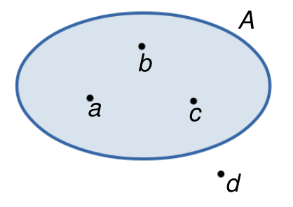
```

## Descrição de um conjunto

Um conjunto pode ser descrito enumerando explicitamente os elementos do conjunto ou descrevendo uma propriedade característica de seus elementos.

Exemplos:

- Conjunto das vogais: $\{a, e, i, o, u\}$
- Conjunto dos números ímpares positivos: $\{1, 3, 5, 7, 9,\ldots\}$
- Conjunto dos inteiros positivos entre $1$ e $100$: $\{1, 2, 3,\ldots,100\}$
- $\{x\ |\ x \mbox{ é divisor inteiro de } 3\}$ = $\{1, -1, 3, -3\}$
- $\{x\ |\ x \mbox{ é inteiro e } 0\leq x\leq 50\}$ = $\{0, 1, 2,\ldots,50\}$

## Conjunto vazio

Chama-se *conjunto vazio* aquele conjunto que não possui elementos. Ele é denotado por $\emptyset$.

Exemplos:

- $\{x\ |\ x\neq x\} = \emptyset$
- $\{x\ |\ x \mbox{ é impar e múltiplo de } 2\} = \emptyset$
- $\{x\ |\ x>0 \mbox{ e } x<0\} = \emptyset$

## Conjunto universo

Em todo problema matemático envolvendo conjuntos, admitimos a existência de um conjunto $U$ ao qual pertencem todos os elementos utilizados no problema. Tal conjunto é chamado de *conjunto universo*.

Exemplos:

- $\{x\in U\ |\ x \mbox{ é um estado da região sul do Brasil}\} = \{$Paraná, Santa Catarina, Rio Grande do Sul$\}$. Neste caso, $U$ é o conjunto de todos os estados do Brasil.
- $\{x\in U\ |\ x \mbox{ é vogal}\}= \{a, e, i, o, u\}$. Neste caso, $U$ é o conjunto das letras do alfabeto da língua portuguesa.
- $\{x\in U\ |\ x \mbox{ é divisor inteiro de } 3\} = \{1, -1, 3, -3\}$. Neste caso, podemos considerar $U=\mathbb{Z}$ (conjunto dos inteiros).

Muitas vezes, a resposta a nosso problema depende do conjunto universo que estamos considerando.

Exemplo: 

Qual é o conjunto dos pontos $P$ que ficam a igual distância dos pontos $A$ e $B$ ? 

Se consideramos o conjunto universal $U$ como sendo a reta que contém os pontos $A$ e $B$, então o conjunto $P$ dos pontos equidistantes de $A$ e $B$ está formado por um único ponto, como mostra a seguinte figura:

&nbsp;

```{r conj02, echo=FALSE, fig.cap="", out.width='40%', fig.align="center"}
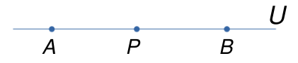
```

&nbsp;

Por outra parte, se consideramos $U$ como sendo o plano contendo os pontos $A$ e $B$, então o conjunto $P$ é a reta mediatriz do segmento $AB$, como mostra a figura embaixo: 

&nbsp;

```{r conj03, echo=FALSE, fig.cap="", out.width='45%', fig.align="center"}
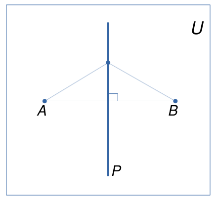
```

&nbsp;

## Conjuntos iguais

Dois conjuntos $A$ e $B$ são iguais se todo elemento de $A$ pertence a $B$ e todo elemento de $B$ pertence a $A$.

$$A=B\ \ \Longleftrightarrow\ \ \forall x, (x\in A \Leftrightarrow x\in B)$$

Se o conjunto $A$ é diferente do conjunto $B$, escrevemos $A\neq B$.

Exemplos:

- $\{a, b, c, d\} = \{b, a, d, c\}$
- $\{x\ |\ 3x+2 = 8\} = \{2\}$
- $\{a, b, c\}\neq\{a, b, c, d\}$

## Subconjuntos

Um conjunto $A$ é um *subconjunto* do conjunto $B$ se todo elemento de $A$ é também um elemento de $B$.

$$A\subset B\ (\mbox{ou } B\supset A)\ \ \Longleftrightarrow\ \ \forall x, (x\in A \Rightarrow x \in B)$$

&nbsp;

```{r conj04, echo=FALSE, fig.cap="", out.width='45%', fig.align="center"}
knitr::include_graphics('conj04.png')
```

&nbsp;

Leia-se: $A\subset B$ ($A$ está contido em $B$) e $B\supset A$ ($B$ contém $A$). Se $A$ não está contido em $B$ (ou $B$ não contém $A$) escrevemos $A\nsubseteq B$ (ou $B\nsupseteq A$).

Podemos definir a igualdade entre conjuntos através da inclusão. De fato, temos que 

$$A = B \ \ \Longleftrightarrow\ \ (A\subset B \mbox{ e } B\subset A)$$

Exemplos:

- $\{a, b, c\}\subset \{a, b, c, d\}$
- $\{x\ |\ x \mbox{ é inteiro e par}\}\subset \{x\ |\ x \mbox{ é inteiro}\}$
- $\{a, b\}\nsubseteq \{a, c, d, e\}$
- $\{x\ |\ x \mbox{ é inteiro e par}\}\nsubseteq \{x\ |\ x \mbox{ é inteiro e primo}\}$

Sejam $A, B$ e $C$ conjuntos. Algumas propriedades da inclusão são as seguintes:

1. Para todo conjunto $A$, temos que $\emptyset\subset A$
2. $A\subset A$ (reflexiva)
3. $(A\subset B \mbox{ e } B\subset A)\ \Longrightarrow\ A=B$ (anti-simétrica)
4. $(A\subset B \mbox{ e } B\subset C)\ \Longrightarrow\ A\subset C$ (transitiva)

## Conjunto das partes

Dado um conjunto $A$, o *conjunto das partes de* $A$ é o conjunto formado por todos os subconjuntos de $A$:

$$\mathcal{P}(A) = \{B\ |\ B\subset A\}$$

Observar que $\mathcal{P}(A)$ é um conjunto cujos elementos também são conjuntos.

Por exemplo, se $A = \{a, b, c\}$, então $\mathcal{P}(A) = \{\emptyset, \{a\}, \{b\}, \{c\}, \{a, b\}, \{a, c\}, \{b, c\}, A\}$.

Pode-se provar que se $A$ contém $n$ elementos, então $\mathcal{P}(A)$ contém $2^n$ elementos.

## União e interseção de conjuntos

Dados dois conjuntos $A$ e $B$, a *união* de $A$ com $B$ é o conjunto formado pelos elementos que pertencem a $A$ ou a $B$:

$$A\cup B = \{x\ |\ x\in A \mbox{ ou } x\in B\}$$

&nbsp;

```{r conj10, echo=FALSE, fig.cap="", out.width='50%', fig.align="center"}
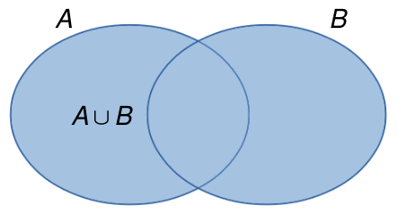
```

&nbsp;


Exemplos:

- $\{a, b\}\cup \{c, d\} = \{a, b, c, d\}$
- $\{a, b, c\}\cup \{c, e, f\} = \{a, b, c, e, f\}$
- $\{a, b\}\cup \emptyset = \{a, b\}$
- $\emptyset \cup \emptyset = \emptyset$

Sejam $A, B$ e $C$ conjuntos. Algumas propriedades da união são as seguintes:

1. $A\cup A = A$ (idempotente)
2. $A \cup \emptyset = A$ (elemento neutro)
3. $A\cup B = B\cup A$ (comutativa)
4. $(A\cup B)\cup C = A\cup (B\cup C)$ (associativa)
5. $A\subset (A\cup B)$

&nbsp;

Dados dois conjuntos $A$ e $B$, a *interseção* de $A$ com $B$ é o conjunto formado pelos elementos que pertencem a $A$ e a $B$:

$$A\cap B = \{x\ |\ x\in A \mbox{ e } x\in B\}$$

&nbsp;

```{r conj05, echo=FALSE, fig.cap="", out.width='50%', fig.align="center"}
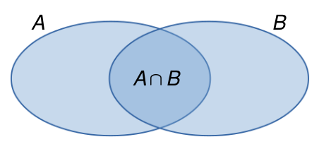
```

&nbsp;


Dois conjuntos $A$ e $B$ são *disjuntos* se eles não tem elementos em comum, ou seja, $A\cap B = \emptyset$.

&nbsp;

```{r conj06, echo=FALSE, fig.cap="", out.width='60%', fig.align="center"}
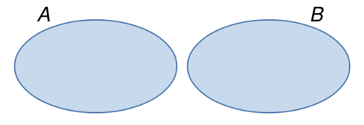
```

&nbsp;


Exemplos:

- $\{a, b, c\}\cap\{a, b, d, e\} = \{a, b\}$
- $\{a, b\}\cap\{a, b, c\} = \{a, b\}$
- $A\cap\emptyset = \emptyset$
- $\{a, b\}\cap\{c, d\} = \emptyset$

Sejam $A, B$ e $C$ conjuntos. Algumas propriedades da interseção são as seguintes:

1. $A\cap A = A$ (idempotente)
2. Se $A\subset B$, então $A\cap B = A$. Em particular, para todo conjunto $A$, temos que $A\cap U = A$ (elemento neutro)
3. $A\cap B = B\cap A$ (comutativa)
4. $A\cap (B\cap C) = (A\cap B)\cap C$ (associativa)
5. $(A\cap B)\subset A$

Outras propriedades envolvendo uniões e interseções são as seguintes:

1. $A\cup (B\cap C) = (A\cup B) \cap (A\cup C)$ (distributiva da união em relação à interseção)
2. $A\cap (B\cup C) = (A\cap B) \cup (A\cap C)$ (distributiva da interseção em relação à união)
3. $A\cup (A\cap B) = A$
4. $A\cap (A\cup B) = A$


## Complementar de um conjunto

Dado um conjunto $A$, o *complementar* de $A$ (em relação a $U$) é o conjunto formado pelos elementos do conjunto universo $U$ que não estão em $A$:

$$A^{\mathrm{c}} = \{x\in U\ |\ x\not\in A\}$$
Observe que a definição de complementar depende do conjunto universo considerado.

&nbsp;

```{r conj07, echo=FALSE, fig.cap="", out.width='56%', fig.align="center"}
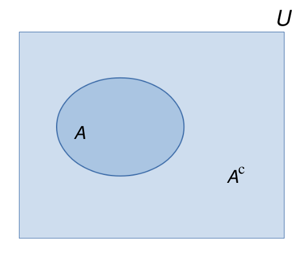
```

&nbsp;

Exemplos:

- Se $U = \{a, b, c, d, e, f\}$, então $\{a, b, c\}^{\mathrm{c}} = \{d, e, f\}$
- Se $U = \{1, 2, 3, 4,\ldots\}$ (conjunto dos números naturais), então $\{1,3\}^{\mathrm{c}} = \{2, 4, 5, 6,\ldots\}$ 

Em particular, temos que

- $U^\mathrm{c} = \emptyset$
- $\emptyset^\mathrm{c} = U$

## Diferença de conjuntos

Dados dois conjuntos $A$ e $B$, a *diferença* entre $A$ e $B$ é o conjunto formado pelos elementos de $A$ que não estão em $B$:

$$A-B = \{x\ |\ x\in A \mbox{ e } x\not\in B\}$$

Pode-se provar que $A-B = A\cap B^\mathrm{c}$.

&nbsp;

```{r conj08, echo=FALSE, fig.cap="", out.width='50%', fig.align="center"}
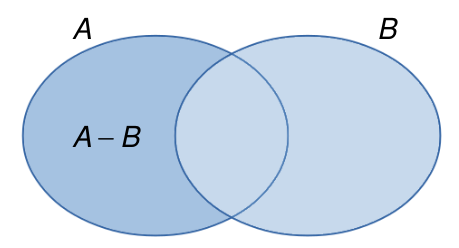
```

&nbsp;

Exemplos:

- $\{a,b\}-\{b,c,d\}=\{a\}$
- $\{a,b\}-\{c,d,e\}=\{a,b\}$
- $\{a,b\}-\emptyset=\{a,b\}$
- $\{a,b\}-\{a,b,c,d\}=\emptyset$


A *diferença simétrica* entre $A$ e $B$ é definida como o conjunto formado pelos elementos que estão em $A\cup B$ e que não estão em $A\cap B$:

$$A\Delta B = (A\cup B) - (A\cap B) = (A\cup B)\cap (A\cap B)^\mathrm{c}=(A-B)\cup(B-A)$$

&nbsp;

```{r conj09, echo=FALSE, fig.cap="", out.width='50%', fig.align="center"}
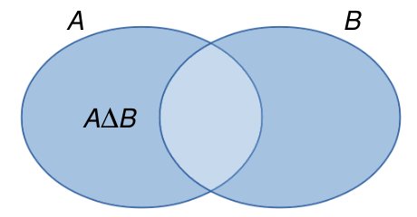
```

&nbsp;

Exemplos:

- $\{a,b,c\}\Delta \{c,d,e\}=\{a,b,d,e\}$
- $\{a,b\}\Delta\{c,d\}=\{a,b,c,d\}$
- $\{a,b\}\Delta\{a,b,c,d\}=\{c,d\}$
- $\{a,b\}\Delta\{a,b\}=\emptyset$


Operações de conjuntos envolvendo uniões, interseções, complementares e diferênças são chamadas de *operações boleanas de conjuntos*.


## Conjuntos numéricos

### Conjunto dos números naturais

O conjunto $\mathbb{N}=\{1,2,3,4,5,\ldots\}$ é chamado conjunto dos números naturais e é denotado por $\mathbb{N}$. É o conjunto que possui o $1$ e todos os seus sucessores.

### Conjunto dos números inteiros

O conjunto $\mathbb{Z}=\{\ldots,-4, -3, -2, -1,0,1,2,3,4,\ldots\}$ é chamado conjunto dos números inteiros e é denotado por $\mathbb{Z}$. Esse conjunto é a extensão dos números naturais, acrescentando os elementos negativos e o zero.

### Conjunto dos números racionais

O conjunto dos números racionais é denotado por $\mathbb{Q}$. Um elemento de $\mathbb{Q}$ é da forma $\displaystyle\frac{a}{b}$, em que $a,b\in\mathbb{Z}$ e $b\neq0$, ou seja

$$\mathbb{Q}=\{\displaystyle\frac{a}{b}\ :\ a,b\in\mathbb{Z},\ b\neq0\}$$

### Conjunto dos números irracionais

O conjunto dos números irracionais é denotado por $\mathbb{I}$, e está formado por todos os números que não pertencem a $\mathbb{Q}$, ou seja

$$\mathbb{I}=\{x\ :\ x\not\in\mathbb{Q}\}$$
Um exemplo de número irracional é $\sqrt{2}$. De fato, pode-se provar que não existem $a,b\in\mathbb{Z},\ b\neq0$, tal que $\sqrt{2}=\displaystyle\frac{a}{b}$. Para provar isso, suponha pelo absurdo que $\sqrt{2}=\displaystyle\frac{a}{b}$, em que $\displaystyle\frac{a}{b}\in\mathbb{Q}$ é irredutível (a fração já está reduzida a sua mínima expressão). Assim,

$$\sqrt{2}=\displaystyle\frac{a}{b}$$
Elevando ao quadrado ambos os membros, obtemos que 
$$2 = \left(\displaystyle\frac{a}{b}\right)^2$$
$$2b^2=a^2$$
Logo $a^2$ é par, o qual implica que $a$ é par, ou seja, $a=2m$ para algúm $m\in\mathbb{Z}$ (exercício 19). Sendo assim,

$$2b^2=(2m)^2=4m^2$$
$$b^2=2m^2$$
o qual implica que $b$ é par, ou seja, $b=2n$, para algúm $n\in\mathbb{Z}$.
Portanto
$$\displaystyle\frac{a}{b}=\frac{2m}{2n}=\frac{m}{n}$$
O anterior contradiz o fato que $\displaystyle\frac{a}{b}$ é irredutível. Concluímos então que $\sqrt{2}\not\in\mathbb{Q}$, ou seja, $\sqrt{2}\in\mathbb{I}$.

Outros exemplos de números irracionais são: 

- $\sqrt{p}$, em que $p$ é um numero primo.
- $\pi=3,141592\ldots$.
- ${\rm e}=2,718281\ldots$

### Conjunto dos números reais

O conjunto dos números reais, denotado por $\mathbb{R}$, é definido como $\mathbb{R}=\mathbb{Q}\cup\mathbb{I}$. Esse conjunto é munido de duas operações, a *adição* $(+)$, a *multiplicação* $(\cdot)$ e uma relação de ordem $(\leq)$. Para $a,b,c\in\mathbb{R}$, as operações de adição e multiplicação e a relação de ordem possuem as seguintes propriedades:

(A1) *Associatividade da adição*: $a+(b+c)=(a+b)+c$

(A2) *Comutatividade da adição*: $a+b=b+a$

(A3) *Elemento neutro da adição*: existe $0\in\mathbb{R}$ tal que para todo $a\in\mathbb{R}$, $0+a=a+0=a$

(A4) *Inverso aditivo*: para todo $a\in\mathbb{R}$, existe um $b\in\mathbb{R}$ tal que $a+b=b+a=0$

(M1) *Associatividade da multiplicação*: $a\cdot(b\cdot c)=(a\cdot b)\cdot c$

(M2) *Comutatividade da adição*: $a\cdot b=b\cdot a$

(M3) *Elemento neutro da multiplicação*: existe $1\neq0$ tal que para todo $a\in\mathbb{R}$, $1\cdot a=a\cdot 1=a$

(M4) *Inverso multiplicativo*: para todo $a\in\mathbb{R}$, existe um $b\in\mathbb{R}$ tal que $a\cdot b=b\cdot a=1$

(O1) *Reflexão*: $a\leq a$

(O2) *Antissimetria*: $a\leq b\ $ e $\ b\leq a\ $ $\ \Rightarrow\ $  $\ a=b$

(O3) *Transitividade*: $a\leq b\ $ e $\ b\leq c\ $ $\ \Rightarrow\ $ $\ a\leq c$

(O4) *Tricotomia*: $a<b\ $ ou $\ a=b\ $ ou $\ a>b$

(O5) *Consistência com respeito a adição*: $a\leq b\ $ $\ \Rightarrow\ $ $\ a+c\leq b+c$

(O6) *Consistência com respeito a multiplicação*: se $\ c>0\ $, então $\ a\leq b\ $ $\ \Rightarrow\ $ $\ a\cdot c\leq b\cdot c$

(D1) *Distributividade*: $a\cdot(b+c)=a\cdot b + a\cdot c=b\cdot a + c\cdot a = (b+c)\cdot a$


## Exercícios

1. Descreva os seguintes conjuntos por meio de uma propriedade dos elementos:


- $A=\{+1, -1, +2, -2, +3, -3, +6, -6 \}$
- $B=\{0, -10, -20, -30, -40, \cdots \}$ 
- $C=\{1, 4, 9, 16, 25, 36, \cdots \}$

2. Quais dos conjuntos abaixo são vazios?

- $A=\{x\ |\ 0 \cdot x = 0 \}$
- $B=\{x\ |\ x > \displaystyle\frac{9}{4}\  \mbox{e} \  x < \displaystyle\frac{6}{5}\}$ 
- $C=\{x\ |\ x \  \mbox{é divisor de zero}\}$ 
- $D=\{x\ |\ x \ \mbox{é divisível por zero} \}$ 

3. Construa o conjunto das partes do conjunto $A= \{a, b, c, d \}$.

4. Diga se é verdadeira (V) ou falsa (F) cada uma das sentenças abaixo. Se a sentença for falsa deverá ser justificada.

- $0 \in \{0, 1, 2, 3, 4\}$
- $\{a\} \in \{a, b\}$ 
- $\emptyset \in \{ 0\}$
- $0 \in \emptyset$
- $\{a\}\subset \emptyset$
- $a \in \{a, \{a\}\}$
- $\{a\} \subset \{a, \{a\}\}$
- $\emptyset \subset \{\emptyset, \{a\}\}$
- $\emptyset \in \{\emptyset, \{a\}\}$
- $\{a,b\} \in \{\{a,b,c,d \}\}$

5. Dados os conjuntos $A = \{a,b,c, d\}$, $B = \{b,c,d,e\}$ e $C = \{c, e, f\}$, determine $A\cap B$, $A\cap C$, $B\cap C$ e $A\cap B\cap C$,  $A\cup B$, $A\cup C$, $B\cup C$ e $A\cup B\cup C$. Verifique também se cada união é disjunta.

6. Prove que $A\subset (A\cup B)$, $(A\cap B)\subset A$ e que $(A-B)\subset A$, para todo conjunto $A$ e $B$.

7. Admitindo que $A,B$ e $C$ são conjuntos quaisquer, classifique em verdadeiro (V) ou falso (F) as seguintes sentenças:

- $\emptyset \subset (A \cup B)$ 
- $(A\cup B) \subset A$
- $A \supset (A \cup B)$
- $(A \cup B) \subset (A \cup B)$
- $B \subset (A\cup B)$
- $(A\cup B)\subset (A \cup B \cup C)$
- $\emptyset \subset (A\cap B)$
- $A \subset (A\cap B)$
- $A \in (A\cap B)$
- $(A\cap B) \subset (A \cap B)$
- $(A\cap B) \subset B$
- $(A\cap B) \supset (A \cap B \cap C)$

8. Indique no diagrama abaixo, um de cada vez, os seguintes conjuntos:

- $A\cap B \cap C$
- $A\cap (B \cup C)$
- $A\cup (B \cap C)$
- $A\cup (B \cup C)$

&nbsp;

```{r exc08, echo=FALSE, fig.cap="", out.width='50%', fig.align="center"}
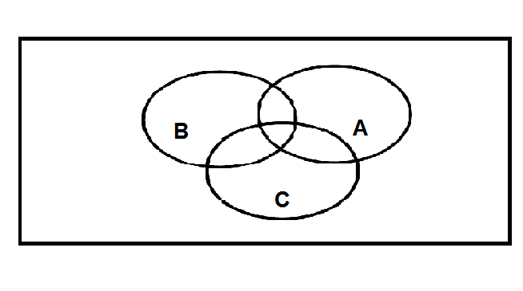
```

&nbsp;

9. Sejam os conjuntos $A = \{a,b,c,d\}$, $B=\{c,d,e,f,g\}$ e $C = \{b,d,e,g\}$. determine:

- $A-B$
- $B-A$
- $C-B$
- $(A\cup C) - B$
- $A - (B \cap C)$
- $(A \cup B) - (A \cap C)$

10. Faça um diagrama para indicar cada um dos conjuntos abaixo:

- $A^c-B$
- $B^c \cup A$
- $(A\cup B)^c$
- $(A\cap B)^c$
- $B^c \cap A$
- $A^c - (A\cup B)$

11. Sejam A e B dois conjuntos finitos. Prove que
$$n_{A \cup B} = n_{A} + n_{B} - n_{A\cap B},$$
em que o símbolo $n_X$ representa o número de elementos do conjunto $X$.

12. Uma pesquisa de mercado foi realizada para investigar sobre a preferência de três marcas de sabão em pó ($A$, $B$ e $C$) entre potenciais consumidores. Os resultados coletados estão apresentados na tabela abaixo:
\vspace*{0.7cm}

&nbsp;

```{r exc12, echo=FALSE, fig.cap="", out.width='115%', fig.align="center"}
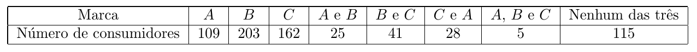
```

&nbsp;

Forneça:

- o número de pessoas consultadas;
- o número de pessoas que só consomem a marca A;
- o número de pessoas que não consomem as marcas A ou C;
- o número de pessoas que consomem ao menos duas marcas.


13. Em uma certa comunidade há indivíduos de três etnias: branca, negra e amarela. Sabendo que 70 são brancos, 350 são não negros e 50$\%$ são amarelos, responda:

- quantos indivíduos tem essa comunidade?
- quantos são os indivíduos amarelos?

14. Dados dois conjuntos $A$ e $B$, chama-se a diferença simétrica de $A$ com $B$ o conjunto tal que:
 $$A\bigtriangleup B = (A-B) \cup (B-A).$$
 
- Prove que $A \bigtriangleup \emptyset = A.$
- Prove que $A \bigtriangleup A = \emptyset$
- Prove que $A \bigtriangleup B = B \bigtriangleup A$, para $A$ e $B$ quaisquer.


15. Sejam $A$, $B$ e $C$ três conjuntos quaisquer. Demonstre que

- $(A-C) \cup (B-C) = (A\cup B)-C$.
- $(A-C) \cap (B-C) = (A\cap B)-C$.


16. Sejam $A$ e $B$ conjuntos quaisquer. Demonstre que $A$ e $B-A$ são disjuntos, e que $A \cup B= A\cup (B-A)$. Isso mostra como representar $A \cup B$ como uma união disjunta.

17. Prove que se $a,b,c$ e $d$ são racionais, $p$ é primo positivo e $a+ b\cdot\sqrt{p} = c+ d\cdot \sqrt{p}$, então $a=c$ e $b=d$.

18. Dados os conjuntos $A=\{1,2,3,4,5\}$, $B=\{1,2,4,6,8\}$, e $C=\{2,4,5,7\}$, obter um conjunto $X$ tal que $A-X=B\cap C$.

18. Dados  dois números $x$ e $y$ reais e positivos, chama-se *média aritmética* de $x$ com $y$ o real $m=\displaystyle\frac{x+y}{2}$ e chama-se *média geométrica* o real $g=\sqrt{xy}$. Mostre que $m\geq g$ para todos $x,y \in \mathbb{R}_{>0}$.

19. Seja $a$ um número inteiro. Prove que

- se $a$ for ímpar, então $a^2$ também será ímpar;
- se $a^2$ for par, então $a$ também será par. 


20. Represente sobre a reta real cada um dos seguintes conjuntos:

- $A = \{ x \in \mathbb{R}\ |\ 1\leqslant x \leqslant 2\}$
- $B = \{ x \in \mathbb{R}\ |\ 0< x < 3\}$
- $C = \{ x \in \mathbb{R}\ |\ x\leqslant 0 \  \mbox{ou}\  x > 2\}$
- $D= \{ x \in \mathbb{R}\ |\ -1< x \leqslant 0 \   \mbox{ou}\  x\geqslant 3 \}$

21. Descreva os seguintes conjuntos:

- $[0,2]\cap [1,3]$
- $[0,2]\cap (1,3)$
- $(-\infty,2) \cap [0, + \infty]$
- $(-1, 3) \cup [0,4]$
- $(-2, 1) \cup [0,5]$
- $\left[-\displaystyle\frac{1}{2}, 0\right) \cup \left(-\displaystyle\frac{3}{2}, -\displaystyle\frac{1}{4} \right]$


22. Determine a interseção entre os conjuntos $\mathbb{R} \cap \mathbb{Q}$, $(\mathbb{N} \cap \mathbb{Z}) \cup \mathbb{Q}\ $ e $\ \mathbb{N} \cup (\mathbb{Z} \cap \mathbb{Q})$.
