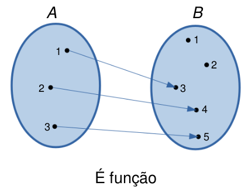
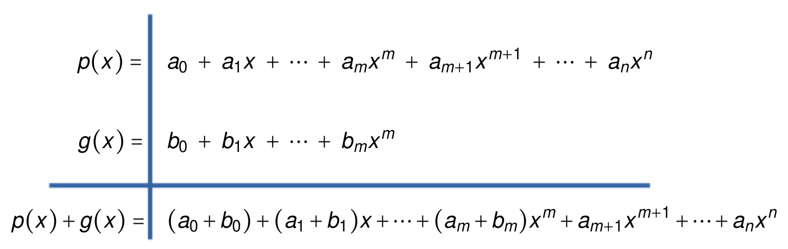
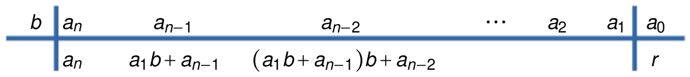
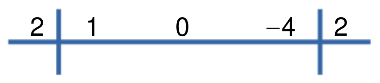
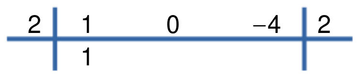
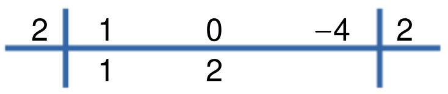
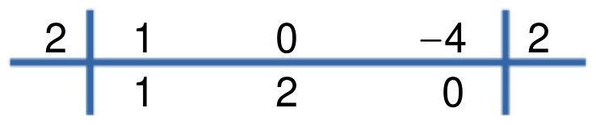
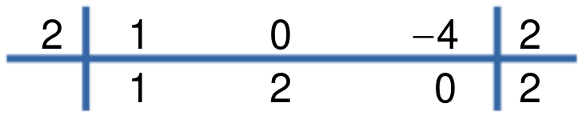
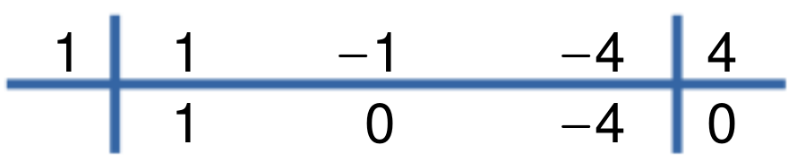

# Funções

## Par ordenado

Dados dois elementos quaisquer $a$ e $b$ de um conjunto, o conjunto $\{a,b\}$ formado por $a$ e $b$ é chamado de par.
Observar que $\{a,b\}=\{b,a\}$ (a ordem não interessa). No entanto, existem situações em que a ordem é importante.

Dados dois elementos $a$ e $b$ de um conjunto, definimos o *par ordenado* formados pelos elementos $a$ e $b$ como sendo o elemento $(a,b)$. Todo par ordenado satisfaz a seguinte condição:

$$(a,b) = (c,d)\ \Longleftrightarrow\ a=c\ \mbox{ e }\ b=d$$

Neste caso, a ordem dos elementos é importante, ou seja, temos que em geral, $(a,b)\neq (b,a)$.

Uma forma geométrica de visualizar um par ordenado $(a,b)$ é representá-lo como um ponto no plano cartesiano. Na figura seguinte são representados graficamente os pares ordenados $A=(0,1)$, $B=(-1,3)$ e $C=(2,2)$.

&nbsp;

```{r func01, echo=FALSE, fig.cap="", out.width='50%', fig.align="center"}

```

&nbsp;

Existe uma correspondência biunívoca entre pares ordenados e pontos do plano cartesiano.

## Produto cartesiano

Sejam $A$ e $B$ conjuntos não vazios. O *produto cartesiano* de $A$ com $B$ é o conjunto formado por todos os pares ordenados $(a,b)$ em que $a\in A$ e $b\in B$:

$$A\times B = \{(a,b)\ :\ a\in A,\ b\in B\}$$

Da definição de produto cartesiano, vemos que se $A$ tem $n$ elementos e $B$ tem $m$ elementos, então $A\times B$ tem $nm$ elementos.

Se $A=\emptyset$ ou $B=\emptyset$, definimos $A\times B = \emptyset$.


Exemplo:

- Se $A=\{2,3,4\}$ e $B=\{1,2\}$, então $A\times B = \{(2,1), (2,2), (3,1), (3,2), (4,1), (4,2)\}$ $B\times A = \{(1,2), (1,3), (1,4), (2,2), (2,3), (2,4)\}$ e $B\times B=B^2=\{(1,1), (1,2), (2,1), (2,2)\}$.

&nbsp;

```{r func03, echo=FALSE, fig.cap="", out.width='50%', fig.align="center"}

```

&nbsp;

Um caso importante é o produto cartesiano $\mathbb{R}\times\mathbb{R} = \mathbb{R}^2 = \{(x,y)\ :\ x,y\in\mathbb{R}\}$ (plano cartesiano).

No caso em que $A = [a,b]$ e $B = [c,d]$ são intervalos da reta, então $A\times B = \{(x,y)\ :\ x\in[a,b] \ \mbox{ e }\ y\in[c,d]\}$.

&nbsp;

```{r func02, echo=FALSE, fig.cap="", out.width='50%', fig.align="center"}
knitr::include_graphics('func02.png')
```

&nbsp;

## Relação binária

Considere os conjuntos $A = \{2,3,4\}$ e $B = \{2,3,4,5,6\}$. O produto cartesiano de $A$ com $B$ é dado por $A\times B = \{(x,y)\ :\ x\in A,\ y\in B\}$ e contém $3\times 5 = 15$ elementos.

Consideremos agora os pares ordenados de $(x,y)\in A\times B$ tais que $x$ é divisor de $y$,

$$R = \{(x,y)\in A\times B\ :\ x \mbox{ é divisor de } y\} = \{(2,2), (2,4), (2,6), (3,3), (3,6), (4,4)\}$$

O conjunto $R$ é um exemplo de *relação binária* de $A$ em $B$. 

&nbsp;

```{r func04, echo=FALSE, fig.cap="", out.width='50%', fig.align="center"}
knitr::include_graphics('func04.png')
```

&nbsp;

Dessa forma, dados dois conjuntos $A$ e $B$, uma *relação binária* de $A$ em $B$ é um conjunto $R$ tal que $R\subset A\times B$. Em particular, para qualquer conjunto $A$, uma relação binária em $A$ é um subconjunto $R\subset A\times A$.

O conjunto $A$ é chamado *conjunto de partida* da relação binária e o conjunto $B$ é chamado *conjunto de chegada*.

Se o par ordenado $(x,y)$ pertence à relação binária $R$, escrevemos $xRy$ ($x$ está relacionado com $y$), ou seja,

$$(x,y)\in R\ \Longleftrightarrow\ xRy$$

Exemplos:

1. Sejam os conjuntos $A= \{1,2,3\}$ e $B= \{1,2,3,4,5\}$. Consideremos a relação $R=\{(x,y)\in A\times B\ :\ y=x+2\}$.

&nbsp;

```{r func05, echo=FALSE, fig.cap="", out.width='40%', fig.align=""}
knitr::include_graphics('func05.png')
knitr::include_graphics('func06.png')
```

&nbsp;

2. Sejam os conjuntos $A = B = [0,1]$. Consideremos a relação $R = \{(x,y)\in A\times B\ :\ x = y\}$.

&nbsp;

```{r func07, echo=FALSE, fig.cap="", out.width='50%', fig.align="center"}

```

&nbsp;

## Domínio e Imagem de uma relação

Dada uma relação binária  $R$ de $A$ em $B$, o *domínio* de $R$ é o conjunto de todos os primeiros elementos dos pares ordenados em $R$, ou seja,

$$D_{R} = \{x\in A\ :\ (x,y)\in R\}\subset A$$

Cháma-se *imagem* de $R$ ao conjunto de todos os segundos elementos dos pares ordenados em $R$, ou seja,

$$Im_{R} = \{y\in B\ :\ (x,y)\in R\}\subset B$$
Nos exemplos anteriores, temos que:

1. $D_{R} =\{1,2,3\}=A$, $Im_{R}=\{3,4,5\}$.
2. $D_R= A$, $Im_{R}=B$.

Se $A = \{x\in\mathbb{R}\ :\ 1\leq x\leq 3\}$, $B = \{y\in\mathbb{R}\ :\ 1\leq y\leq 4\}$ e $R = \{(x,y)\in A\times B\ :\ y = 2x\}$, então, temos que $D_{R} = \{x\in A\ :\ 1\leq x\leq 2\}$ e $Im_{R} = \{y\in B\ :\ 2\leq y\leq 4\}$.

&nbsp;

```{r func08, echo=FALSE, fig.cap="", out.width='50%', fig.align="center"}
knitr::include_graphics('func08.png')
```

&nbsp;

## Relação inversa

Dada uma relação binária $R$ de $A$ em $B$, a relação inversa $R^{-1}$ de $B$ em $A$ é definida por

$$R^{-1} = \{(y,x)\in B\times A\ :\ (x,y)\in R\}$$

Exemplos:

- Sejam os conjuntos $A = \{2,3,4,5\}$ e $B = \{1,3,5,7\}$. Se $R = \{(x,y)\in A\times B\ :\ x<y\} = \{(2,3), (2,5), (2,7), (3,5), (3,7), (4,5), (4,7), (5,7)\}$, então $R^{-1} = \{(x,y)\ :\ x>y\} = \{(3,2), (5,2), (7,2), (5,3), (7,3), (5,4), (7,4), (7,5)\}$.

&nbsp;

```{r func09, echo=FALSE, fig.cap="", out.width='45%', fig.align=""}
knitr::include_graphics('func09.png')
knitr::include_graphics('func10.png')
```

&nbsp;

- Sejam os conjuntos $A = \{x\in\mathbb{R}\ :\ 1\leq x\leq 2\}$ e $B = \{y\in\mathbb{R}\ :\ 1\leq y\leq 4\}$. Se $R = \{(x,y)\in A\times B\ :\ y = 2x\}$, então $R^{-1} = \{(x,y)\in B\times A\ :\ y = \displaystyle\frac{x}{2}\}$.

&nbsp;

```{r func10, echo=FALSE, fig.cap="", out.width='45%', fig.align=""}
knitr::include_graphics('func08.png')

```

&nbsp;

Propriedades:

1. $D_{R^{-1}} = Im_{R}$ (o domínio de $R^{-1}$ é igual à imagem de $R$)
2. $Im_{R^{-1}} = D_{R}$ (a imagem de $R^{-1}$ é igual ao domínio de $R$)
3. $(R^{-1})^{-1} = R$ (a relação inversa de $R^{-1}$ é igual a $R$)

## O conceito de função

Sejam $A$ e $B$ conjuntos não vazios. Uma *aplicação* ou *função* $f$ de $A$ em $B$ é uma relação binária tal que para todo $x\in A$, existe um único ponto $y\in B$ tal que $(x,y)\in R$. Em notação matemática:

$$R \mbox{ é função }\ \Longleftrightarrow\ \forall x\in A,\ \exists\,!\ y\in B \mbox{ tal que } xRy$$

&nbsp;

```{r func11, echo=FALSE, fig.cap="", out.width='45%', fig.align=""}
knitr::include_graphics('func12.png')

```

&nbsp;

&nbsp;

```{r func12, echo=FALSE, fig.cap="", out.width='45%', fig.align=""}

knitr::include_graphics('func15.png')
```

&nbsp;

Observar que a primeira relação não é função, uma vez que, por exemplo, o elemento $2\in A$ é mapeado em três elementos em $B$ ($2,4$ e $6$). A segunda e terceira relação são funções, pois satisfazem a definição. Finalmente, a quarta relação não é função, pois o elemento $3\in A$ não é mapeado em nenhum elemento de $B$. 

Usaremos a notação $f: A \longrightarrow B$ para denotar uma função $f$ de $A$ em $B$. O conjunto $A$ recebe o nome de *domínio da função* (denotado por $D_f$) e o conjunto $B$ é chamado de *contradomínio da função*. 

Se a função $f$ mapea o elemento $x\in A$ no elemento $y\in B$, denotamos isso por $y=f(x)$. Assim, por exemplo, na terceira relação acima, temos que $3=f(2)$, $2=f(3)$ e  $4=f(4)=f(5)$.


Outro conjunto importante é a *imagem da função* (denotada por $Im_f$), definida por

$$Im_f = \{y\in B\ :\ y=f(x), \mbox{ para algum } x\in A\}$$

Por exemplo, na terceira relação (a qual é função), temos que o conjunto imagem é $Im_f=\{2,3,4\}$. Observar que, neste caso, $1\not\in Im_f$, pois não existe um elemento $x$ em $A$ tal que $1 = f(x)$. 

Geralmente, quando o domínio de uma função não é explicitamente dado, consideramos o domínio como sendo o conjunto dos números reais em que a função está definida.

Exemplo: Seja $f(x)=\displaystyle\frac{1}{x-2}$. Nesse caso, dado que a função não está definida para $x=2$, consideramos $D_f=\mathbb{R}-\{2\}=\{x\in\mathbb{R}\ :\ x\neq 2\}$.

## Gráfico de funções

Consideremos uma função $f:A\longrightarrow B$. Em geral, consideraremos funções em que $A$ e $B$ são subconjuntos da reta. Nesse caso, o *gráfico* de $f$ é o subconjunto de $\mathbb{R}^2$ definido por 

$$\mathrm{Graf}(f) = \{(x,f(x))\in\mathbb{R}^2\ :\ x\in A\}$$

Exemplos de funções:

- $f:\mathbb{R}\longrightarrow \mathbb{R}$, definida por $f(x) = x$. Neste caso, $D_f=\mathbb{R}$ e $Im_f=\mathbb{R}$.

&nbsp;

```{r func16, echo=FALSE, fig.cap="", out.width='55%', fig.align=""}
knitr::include_graphics('func16.png')
```

&nbsp;


- $f:\mathbb{R}\longrightarrow \mathbb{R}$, definida por $f(x) = x^2$. Neste caso, $D_f=\mathbb{R}$ e $Im_f = \mathbb{R}_{\geq 0}$.

&nbsp;

```{r func18, echo=FALSE, fig.cap="", out.width='60%', fig.align=""}
knitr::include_graphics('func18.png')
```

&nbsp;

- $f: [-1,2]\longrightarrow \mathbb{R}$, definida por $f(x) = x^3$. Neste caso, $D_f=[-1,2]$ e $Im_f=[-1,8]$.

&nbsp;

```{r func19, echo=FALSE, fig.cap="", out.width='75%', fig.align=""}

```

&nbsp;


Os seguintes são exemplos de relações que não são funções, pois é possível traçar uma reta vertical que corta ao gráfico em dois pontos.

&nbsp;

```{r func17, echo=FALSE, fig.cap="", out.width='95%', fig.align=""}

```

&nbsp;

## Funções iguais 

Duas funções $f:A\longrightarrow B$ e $g:C\longrightarrow D$ são *iguais* se:

- Os domínios são iguais: $A=C$;
- Para todo $x$, $f(x)=g(x)$.

Se as funções $f$ e $g$ são iguais, escrevemos $f=g$. Nesse caso, se verifica facilmente que $Im_f = Im_g$.

## Características importantes das funções

### Zeros (ou raíçes) de uma função

Os zeros de uma função é definido como o conjunto de pontos $x\in D_f$ que satisfazem $f(x)=0$. Nos exemplos anteriores, vemos que $x=0$ é zero das funções $f_1(x)=x$, $f_2(x)=x^2$ e $f_3(x)=x^3$, pois se verifica que $f(0)=0$. 

### Sinal de uma função

Quando graficamos funções, uma característica importante a ser examinada é o sinal da função, isto é, ver quais são os valores de $x\in\mathbb{R}$ tais que $f(x)>0$, $f(x)=0$ ou $f(x)<0$.

Por exemplo, seja a função $y=f(x)$ cujo gráfico é dado por

&nbsp;

```{r func25, echo=FALSE, fig.cap="", out.width='75%', fig.align=""}
knitr::include_graphics('func25.png')
```

&nbsp;

Os zeros da função são $x_1=-2$, $x_2=-1.2$, $x_3=0.3$ e $x_4=2.5$, ou seja, nestes pontos, temos que $f(x)=0$. Do gráfico, podemos observar o seguinte comportamento:

- Para $x< -2$, temos que $f(x)<0$.
- Para $-2<x<-1.2$, temos que $f(x)>0$.
- Para $-1.2<x<0.3$, temos que $f(x)<0$.
- Para $0.3<x<2.5$, temos que $f(x)>0$.
- Para $x>2.5$, temos que $f(x)<0$.

Dessa forma, identificamos $5$ intervalos onde a função não muda de sinal.

&nbsp;

```{r func26, echo=FALSE, fig.cap="", out.width='90%', fig.align=""}
knitr::include_graphics('func26.png')
```

&nbsp;


## Tipos de funções

### Função constante

Uma função $f$ tal que $f(x)=c$ para todo $x\in D_f$, em que $c$ é uma constante, é chamada de *função constante*. Nesse caso, sempre temos que $Im_f=\{c\}$.

Exemplos:

- $f:\mathbb{R}\longrightarrow \mathbb{R}$ definida por $f(x)=2$, para todo $x$. Nesse caso, $D_f=\mathbb{R}$ e $Im_f=\{2\}$.

- $f:\mathbb{R}\longrightarrow \mathbb{R}$ definida por $f(x)=-3$, para todo $x$. Nesse caso, $D_f=\mathbb{R}$ e $Im_f=\{-3\}$.

- $f:\mathbb{R}\longrightarrow \mathbb{R}$ definida por $f(x)=0$, para todo $x$. Nesse caso, $D_f=\mathbb{R}$ e $Im_f=\{0\}$.

&nbsp;

```{r func20, echo=FALSE, fig.cap="", out.width='60%', fig.align=""}
knitr::include_graphics('func20.png')
```

&nbsp;


### Função linear

Uma função $f:\mathbb{R}\longrightarrow\mathbb{R}$ definida por $f(x)=ax$, para todo $x$, em que $a\neq 0$ é uma constante, é chamada *função linear*. Observar que $D_f=\mathbb{R}$ e $Im_f=\mathbb{R}$.
Em particular, quando $a=1$, a função $f(x)=x$, para todo $x$, é chamada *função identidade*. O gráfico da função identidade é mostrado a seguir:

&nbsp;

```{r func21, echo=FALSE, fig.cap="", out.width='60%', fig.align=""}
knitr::include_graphics('func21.png')
```

&nbsp;

### Função afim

Uma função $f:\mathbb{R}\longrightarrow \mathbb{R}$ definida por $f(x)=ax+b$, para todo $x$, em que $a\neq 0$ e $b$ são constantes, é chamada função *afim* ou de $1º$ grau. Se $f$ é função afim, então $D_f=\mathbb{R}$ e $Im_f=\mathbb{R}$.


&nbsp;

```{r func22, echo=FALSE, fig.cap="", out.width='100%', fig.align=""}

```

&nbsp;

O gráfico da função afim $f(x)=ax+b$ é uma reta que corta o eixo de ordenada em $y=b$ (ordenada ao origem) e o eixo de absiça em $x=-\displaystyle\frac{b}{a}$ (zero da função). Observar que quando $b=0$, obtemos a função linear definida anteriormente.

O coeficiente $a$ da função afim é chamado de *coeficente angular* ou *declividade* da reta. O coeficiente $b$ é chamado de *coeficiente linear*. Assim, se $a>0$, dizemos que o gráfico da função afim tem *declividade positiva*, caso contrário ($a<0$) dizemos que tem *declividade negativa*.

A obtenção dos zeros da função afim permitem fazer o seguinte análise do sinal da função:

- Se $a>0$, então $f(x)<0$ se $x<-\displaystyle\frac{b}{a}$ e $f(x)>0$ se $x>-\displaystyle\frac{b}{a}$.
<br>

- Se $a<0$, então $f(x)>0$ se $x<-\displaystyle\frac{b}{a}$ e $f(x)<0$ se $x>-\displaystyle\frac{b}{a}$.

Exemplo: Obtenha a equação da reta que passa pelo ponto $(1,3)$ e tem coeficiente angular igual a $2$.

Temos que a equação geral da reta é $f(x) = ax + b$. Dado que o coeficiente angular é $2$, então $a=2$. Além disso, a reta passa pelo ponto $(1,3)$. Logo, fazendo $x=1$, temos que $f(1)=2\cdot1 + b=3$, o qual implica que $b=1$. Assim, concluimos que a reta tem equação $f(x)=2x+1$. Observar que a reta corta o eixo $x$ no ponto $x_1=-\displaystyle\frac{b}{a}=-\frac{1}{2}$. A ordenada ao origem é $b=1$.

&nbsp;

```{r func28, echo=FALSE, fig.cap="", out.width='55%', fig.align=""}
knitr::include_graphics('func28.png')
```

&nbsp;

### Função quadrática

Uma função $f:\mathbb{R}\longrightarrow \mathbb{R}$ na forma $f(x)=ax^2+bx+c$, em que $a\neq0$, $b$ e $c$ são constantes, é chamada *função quadrática* ou de $2º$ grau.

Exemplos de funções quadráticas:

- $f(x)=2x^2-3x+1$, em que $a=2$, $b=-3$ e $c=1$;
- $f(x)=-5x^2-3$, em que $a=-5$, $b=0$ e $c=-3$;
- $f(x)=\displaystyle\frac{2}{5}x^2+\frac{3}{2}x$, em que $a=\displaystyle\frac{2}{5}$, $b=\displaystyle\frac{3}{2}$ e $c=0$. 

O gráfico de uma função quadrática é uma parábola cuja concavidade é voltada para cima se $a>0$ e voltada para embaixo se $a<0$.

&nbsp;

```{r func23, echo=FALSE, fig.cap="", out.width='100%', fig.align=""}
knitr::include_graphics('func23.png')
```

&nbsp;

O gráfico da função quadrática atinge seu valor mínimo (quando $a>0$) ou seu valor máximo (quando $a<0$) no ponto $x=-\displaystyle\frac{b}{2a}$ (este fato pode ser provado usando o conceito de derivada). Nesses pontos, a função atinge o valor

$$f\!\left(-\displaystyle\frac{b}{2a}\right) = a\left\{-\displaystyle\frac{b}{2a}\right\}^2 + b\left\{-\displaystyle\frac{b}{2a}\right\} + c = -\frac{b^2}{4a}+c=-\frac{b^2-4ac}{4a}=-\frac{\Delta}{4a}$$
O valor $\Delta=b^2-4ac$ é chamado de *discriminante*.

O par ordenado $V=(-\displaystyle\frac{b}{2a}\ ,\ -\frac{b^2}{4a}+c)=(-\displaystyle\frac{b}{2a}\ ,\ -\frac{\Delta}{4a})$ é chamado *vértice da parábola*.

Observar que $D_f=\mathbb{R}$. Além disso:

- Se $a>0$, então $Im_f=\{y\in\mathbb{R}\ :\ y\geq -\displaystyle\frac{\Delta}{4a}\}$.
<br>

- Se $a<0$, então $Im_f=\{y\in\mathbb{R}\ :\ y\leq -\displaystyle\frac{\Delta}{4a}\}$.

Para achar os zeros de uma função quadrática, observemos que 

$$ax^2+bx+c=0\ \Longrightarrow\ x=\displaystyle\frac{-b \pm \sqrt{b^2-4ac}}{2a}=\frac{-b\pm \sqrt{\Delta}}{2a}$$
O valor de $\Delta$ permite "discriminar" entre os seguintes casos:

- Se $\Delta>0$, então a função quadrática tem exatamente duas raíces reais.
- Se $\Delta=0$, então a função quadrática tem exatamente uma raiz real.
- Se $\Delta<0$, então a função quadrática não tem raíces reais.

As três situações são ilustradas no seguinte gráfico quando $a>0$.

&nbsp;

```{r func24, echo=FALSE, fig.cap="", out.width='100%', fig.align=""}
knitr::include_graphics('func24.png')
```

&nbsp;

Para fazer uma análise do sinal da função quadrática $f(x)=ax^2 +bx +c$, devemos considerar o sinal do discriminante $\Delta$ e da constante $a$. Assim, temos seis casos possíveis:

- Se $\Delta>0$, então temos duas raíçes reais e distintas, digamos $x_1$ e $x_2$, sendo $x_1<x_2$ e $f(x_1)=f(x_2)=0$. Nesse caso, temos duas situações: se $a>0$, temos que $f(x)>0$ para $x<x_1$ e $x>x_2$, e $f(x)<0$ para $x_1<x<x_2$. Se $a<0$, então $f(x)<0$ para $x<x_1$ e $x>x_2$, e $f(x)>0$ para $x_1<x<x_2$.
- Se $\Delta=0$, então temos uma única raíz real $x_1$, sendo $f(x_1)=0$. Assim temos que se $a>0$, então $f(x)>0$ para todo $x\neq x_1$. Se $a<0$, então $f(x)<0$ para todo $x\neq x_1$.
- $\Delta<0$, então não existem raíçes reais. Portanto, se $a>0$, então $f(x)>0$ para todo $x$. Se $a<0$, então $f(x)<0$ para todo $x$.

Como exemplo, considere a função quadrática $f(x)=x^2-2x+1$. Neste caso, $a=c=1$ e $b=-2$. Observar que $\Delta=(-2)^2 - 4\cdot1\cdot1=0$. Logo, a função tem uma única raíz real $x_1=\displaystyle\frac{-b\pm\sqrt{\Delta}}{2a}=1$. Dado que $a=1>0$, vemos que a $f(x)>0$ para $x\neq 1$ e $f(1)=0$. A ordenada ao origem é $-\displaystyle\frac{b}{2a}=1$.

&nbsp;

```{r func27, echo=FALSE, fig.cap="", out.width='55%', fig.align=""}
knitr::include_graphics('func27.png')
```

&nbsp;

### Função cúbica

Uma função cúbica é da forma $f(x)=ax^3+bx^2+cx+d$, sendo $a\neq0$. O gráfico do caso especial $f(x)=x^3$ (quando $a=1$ e $b=c=d=0$) é apresentado a seguir:

&nbsp;

```{r cubic, echo=FALSE, fig.cap="", out.width='55%', fig.align=""}

```

&nbsp;

Temos que $D_f=\mathbb{R}$. Além disso, $Im_f={R}$, pois dado $y\in\mathbb{R}$, existe $x=\sqrt[3]{y}$ tal que $f(x)=f(\sqrt[3]{y})=(\sqrt[3]{y})^3=y$.

O zero da função é $x=0$.

Observar que $f(x)=x^3$ é uma função crescente, ou seja

$$\mbox{Se }\ x_1<x_2\ \Longrightarrow\ x_1^3<x_2^3$$

### Função recíproca

A função recíproca é definida por 

$$f(x)=\frac{1}{x}$$

Observar que $D_f=\{x\in\mathbb{R}\ :\ x\neq0\}=\mathbb{R}-\{0\}$, pois a função não está definida em $x=0$.
A imagem é $Im_f=\mathbb{R}-\{0\}$, pois não existe $x\in D_f$ tal que $f(x)=0$.

Se $x_1<x_2<0$, então $\displaystyle\frac{1}{x_2}<\frac{1}{x_1}<0$. Se $0<x_1<x_2$, então $0<\displaystyle\frac{1}{x_2}<\frac{1}{x_1}$. Portanto, a função recíproca é decrescente.

A função tem por gráfico uma hipérbole equilátera.

&nbsp;

```{r reciproca, echo=FALSE, fig.cap="", out.width='55%', fig.align=""}

```

&nbsp;


### Função Modular

Dado um número real $x$, definimos o módulo (ou valor absoluto) de $x$ como

$$|\,x\,|=x,\ \mbox{ se } x\geq0,\quad |\,x\,|=-x,\ \mbox{ se } x<0$$

Assim, por exemplo, $|\,5\,|=5$ e $|\,-3\,|=3$.

Da definição de módulo decorrem as seguintes propriedades:

1. $|\,x\,|\geq0$, $\forall x\in\mathbb{R}$

2. $|\,x\,|=0\ \Leftrightarrow\ x=0$

3. $|\,x\cdot y\,|=|\,x\,|\cdot|\,y\,|$, $\forall x,y\in\mathbb{R}$

4. $|\,x\,|^2=x^2$, $\forall x\in\mathbb{R}$

5. $x\leq|\,x\,|$, $\forall x\in\mathbb{R}$

6. $|\,x+y\,|\leq |\,x\,|+|\,y\,|$, $\forall x,y\in\mathbb{R}$ (desigualdade triangular)

7. $|\,x-y\,|\geq |\,x\,|-|\,y\,|$, $\forall x,y\in\mathbb{R}$

8. $|x|\leq a$\ e \ $a>0\ \Leftrightarrow\ -a\leq x\leq a$ 

9. $|\,x\,|\geq a$\ e \ $a>0\ \Leftrightarrow\ x\leq -a$\  ou\ $x\geq a$

Definimos a função modular como sendo a função $f:\mathbb{R}\longrightarrow\mathbb{R}$ dada por $f(x)=|\,x\,|,\ x\in\mathbb{R}$.

&nbsp;

```{r modular, echo=FALSE, fig.cap="", out.width='70%', fig.align=""}
knitr::include_graphics('modular.png')
```

&nbsp;

Observar que $f(x)=|\,x\,|\geq0$ para todo $x$ e, portanto, $Im_f=\mathbb{R}_{\geq0}$. 

## Funções definidas por partes

Uma função $f$ pode estar definida por partes, como mostra o seguinte exemplo:

Exemplo: Graficar a função $f$ definida por 

$$f(x)=-x\ \mbox{ se }\ x<-1,\quad f(x)=x^2-1\, \mbox{ se }\ x\geq1$$

&nbsp;

```{r partes, echo=FALSE, fig.cap="", out.width='50%', fig.align=""}
knitr::include_graphics('partes.png')
```

&nbsp;

### Gráfico de funções modulares

Exemplo 1: Graficar a função $f(x)=|\,2x\,|$.

Observar que $f(x)=2x$ se $x\geq0$, e $f(x)=-2x$ se $x<0$. 

&nbsp;

```{r mod01, echo=FALSE, fig.cap="", out.width='30%', fig.align=""}
knitr::include_graphics('mod01_01.png')

knitr::include_graphics('mod01_03.png')
```

&nbsp;

Exemplo 2: Graficar a função $f(x)=|\,x-1\,|$.

Observar que $f(x)=x-1$ se $x\geq1$, e $f(x)=1-x$ se $x<1$.

&nbsp;

```{r mod02, echo=FALSE, fig.cap="", out.width='30%', fig.align=""}
knitr::include_graphics('mod02_01.png')
knitr::include_graphics('mod02_02.png')
knitr::include_graphics('mod02_03.png')
```

&nbsp;

Exemplo 3: Graficar a função $f(x)=|\,x^2-1\,|$.

Observar que $f(x)=x^2-1$ se $x\geq1$ ou $x\leq-1$, e $f(x)=1-x^2$ se $-1<x<1$.

&nbsp;

```{r mod03, echo=FALSE, fig.cap="", out.width='30%', fig.align=""}
knitr::include_graphics('mod03_01.png')

knitr::include_graphics('mod03_03.png')
```

&nbsp;

### Equações modulares

Lembrar que, por definição de módulo

$$|\,x\,|=a\ \Longleftrightarrow\ x=a\ \mbox{ ou }\ x=-a$$

Assim, usando essa propriedade, podemos resolver equações modulares.

Exemplo 1: Resolver $|\,2x-1\,|=5$.

Temos que 
$$|\,2x-1\,|=5\ \Longleftrightarrow\ 2x-1=5\ \mbox{ ou }\ 2x-1=-5$$

Se $2x-1=5$, então $x=3$. Se $2x-1=-5$, então $x=-2$. Logo, o conjunto de soluções da equação $|\,2x-1\,|=5$ é dado por $S=\{3,-2\}$.

Exemplo 2: Resolver $|\,3x-1\,|=|\,2x+3\,|$.

Pela propriedade de módulo, devemos ter $|\,a\,|=|\,b\,|\ \Leftrightarrow\ a=b\ \mbox{ ou }\ a=-b$. Portanto

$$|\,3x-1\,|=|\,2x+3\,|\ \Longleftrightarrow\ 3x-1=2x+3\ \mbox{ ou }\ 3x-1=-2x-3$$

Se $3x-1=2x+3$, então $x=4$. Se $3x+1=-2x-3$, então $x=-\displaystyle\frac{2}{5}$. Logo, o conjunto solução da equação $|\,3x-1\,|=|\,2x+3\,|$ é dado por $S=\{4,-\displaystyle\frac{2}{5}\}$.

Exemplo 3: Resolver $|\,x+1\,|=3x+2$.

Pela propriedade de módulo, sabemos que $|\,a\,|\geq0$ para todo $a\in\mathbb{R}$. Assim, temos que 

$$3x+2\geq0\ \Rightarrow\ x\geq-\displaystyle\frac{2}{3}$$
Novamente, temos duas possibilidades: $x+1=3x+2$ ou $x+1=-3x-2$.

Se $x+1=3x+2$, então $x=-\displaystyle\frac{1}{2}$. Se $x+1=-3x-2$, então $x=-\displaystyle\frac{3}{4}$. Observar que das duas possíves soluções, somente a primeira satisfaz a condição de ser maior que $-\displaystyle\frac{2}{3}$. Assim, a única solução da equação $|\,x+1\,|=3x+2$ é  $x=-\displaystyle\frac{1}{2}$.

### Inequações modulares

Usando as seguintes propriedades de módulo (para $a>0$):

$$|\,x\,|\leq a\ \ \Longleftrightarrow\ -a\leq x\leq a$$

$$|\,x\,|\geq a\ \Longleftrightarrow\ x\geq a\ \mbox{ ou }\ x\leq -a$$
Podemos resolver inequações modulares.

Exemplo 1: Resolver $|\,2x+1\,|<3$

Das propriedades de módulo, temos que 

$$|\,2x+1\,|<3\ \Leftrightarrow\ -3<2x+1<3\ \Leftrightarrow\ -4<2x<2\ \Leftrightarrow\ -2<x<1$$

Assim, o conjunto solução é dado por $S=\{x\in\mathbb{R}\ :\ -2<x<1\}$.

Exemplo 2: Resolver $|\,2x+1\,|>5$

Das propriedades de módulo, resulta

$$|\,4x+1\,|>5\ \Leftrightarrow\ 4x+1>5\ \mbox{ ou }\ 4x+1<-5\ \Leftrightarrow\ x>1\ \mbox{ ou }\ x<-\displaystyle\frac{3}{2}$$

Portanto, o conjunto solução é dado por $S=\{x\in\mathbb{R}\ :\ x>1\ \mbox{ ou }\ x<-\displaystyle\frac{3}{2}\}$

Exemplo 3: Resolver $|\,x+1\,|\leq 3x-2$

Das propriedades de módulo, temos que 

$$-3x+2\leq x+1\leq 3x-2$$
Da primeira desigualdade, obtemos

$$-3x+2\leq x+1\ \Leftrightarrow\ 4x\geq1\ \Leftrightarrow\ x\geq\displaystyle\frac{1}{4}$$

Da segunda desigualdade, resulta

$$x+1\leq3x-2\ \Leftrightarrow\ 2x\geq3\ \Leftrightarrow\ x\geq\displaystyle\frac{3}{2}$$
Dado que ambas desigualdades devem ser satisfeitas ao mesmo tempo, o conjunto solução é dado por

$$S=\{x\in\mathbb{R}\ :\ x\geq\displaystyle\frac{1}{4}\}\cap\{x\in\mathbb{R}\ :\ x\geq\displaystyle\frac{3}{2}\}=\{x\in\mathbb{R}\ :\ x\geq\displaystyle\frac{3}{2}\}$$

&nbsp;

```{r ineq01, echo=FALSE, fig.cap="", out.width='70%', fig.align=""}
knitr::include_graphics('ineq01.png')
```

&nbsp;

Exemplo 4: Resolver $|\,3x-1\,|>2x+2$

Das propriedades de módulo, temos que

$$|\,3x-1\,|>2x+2\ \Leftrightarrow\ 3x-1>2x+2\ \mbox{ ou }\ 3x-1<-2x-2$$

Da primeira desigualdade, resulta

$$3x-1>2x+2\ \Leftrightarrow\ x>3$$

Da segunda desigualdade, temos que

$$3x-1<-2x-2\ \Leftrightarrow\ x<-\displaystyle\frac{1}{5}$$

Dado que pelo menos uma das desigualdades deve ser satisfeita, o conjunto solução é dado por

$$S=\{x\in\mathbb{R}\ :\ x>3\}\cup \{x\in\mathbb{R}\ :\ x<-\displaystyle\frac{1}{5}\}=\{x\in\mathbb{R}\ :\ x<-\displaystyle\frac{1}{5}\ \mbox{ou}\ x>3\}$$

&nbsp;

```{r ineq02, echo=FALSE, fig.cap="", out.width='70%', fig.align=""}
knitr::include_graphics('ineq02.png')
```

&nbsp;

Exemplo 5: Resolver $|\,2x-6\,|-|\,x\,|\leq 4-x$

Observar que 

$$|\,2x-6\,|=2x-6\ \mbox{ se }\ x\geq 3, \quad |\,2x-6\,|=-2x+6\ \mbox{ se }\ x<3$$

$$|\,x\,|=x\ \mbox{ se }\ x\geq0, \quad |\,x\,|=-x\ \mbox{ se }\ x<0$$

&nbsp;

```{r ineq03, echo=FALSE, fig.cap="", out.width='80%', fig.align=""}
knitr::include_graphics('ineq03.png')
```

&nbsp;

1º) Se $x\geq3$, então 

$$|\,2x-6\,|-|\,x\,|\leq 4-x\ \Longleftrightarrow\ x-6\leq4-x\ \Longleftrightarrow\ x\leq5$$

Nesse caso, o conjunto solução é dado por

$$S_1=[3,+\infty)\cap(-\infty,5]=[3,5]$$

2º) Se $0\leq x<3$, então

$$|\,2x-6\,|-|\,x\,|\leq 4-x\ \Longleftrightarrow\ -3x+6\leq 4-x\ \Longleftrightarrow\ x\geq1$$
Nesse caso, o conjunto solução é dado por

$$S_2=[0,3)\cap[1,+\infty)=[1,3)$$
3º) Se $x<0$, então

$$|\,2x-6\,|-|\,x\,|\leq 4-x\ \Longleftrightarrow\ -x+6\leq 4-x\ \Longleftrightarrow\ 6\leq4$$
o qual é um absurdo. Nesse caso, o conjunto solução é $S_3=\emptyset$.

Assim, temos que o conjunto solução da inequação $|\,2x-6\,|-|\,x\,|\leq 4-x$ é dado por

$$S=S_1\cup S_2\cup S_3=[3,5]\cup[1,3)\cup\emptyset=[1,5]$$

## Polinômios

Um polinômio na incógnita $x$ é uma expressão dada na seguinte forma:

$$p(x)=a_0 + a_1x + a_2 x^2 + \cdots + a_{n-1}x^{n-1} + a_n x^n,$$
em que $n\in\mathbb{N}$ e $a_0,\ldots,a_n$ são coeficientes reais, com $a_n\neq0$. O grau do polinômio é $n$, que é o maior exponente de $x$. Um polinômio na forma $p(x)=a_jx^j$ é chamado de monômio.

### Soma de polinômios

Para somar polinômios devemos somar os termos semelhantes, ou seja, os termos que possuem as mesmas potências de $x$. Assim, somando os polinômios $p(x)=a_0 + a_1x + \cdots + a_nx^n$ e $g(x)=b_0 + b_1x + \cdots + b_mx^m$ e considerando $n>m$, obtemos o seguinte polinômio:

$$p(x) + g(x) = (a_0+b_0) + (a_1+b_1)x + \cdots + (a_m+b_m)x^m + a_{m+1}x^{m+1} + \cdots + a_nx^n$$

&nbsp;

```{r soma, echo=FALSE, fig.cap="", out.width='80%', fig.align=""}

```

&nbsp;

Observe que o grau do polinômio $p(x)+g(x)$ é igual a $n$, que é o maior grau entre os dois polinômios $p(x)$ e $g(x)$.

### Multiplicação de polinômios

Para multiplicar polinômios devemos multiplicar cada monômio de um polinômio com os termos do outro polinômio, ou seja, dados $p(x)=a_0 + a_1x + \cdots + a_nx^n$ e $g(x)=b_0 + b_1x + \cdots + b_mx^m$, temos que 

$$p(x)\,g(x) = (a_0 + a_1x + \cdots + a_nx^n)(b_0 + b_1x + \cdots + b_mx^m)=$$
$$= (a_0b_0) + (a_0b_1+a_1b_0)x + (a_0b_2 + a_1b_1 + a_2b_0)x^2 + \cdots + (a_nb_m)x^{n+m}$$

Observe que o grau do produto é a soma dos graus dos dois polinômios.

### Divisão de polinômios

Sejam os polinômios $p(x)$ e $g(x)$, em que o grau de $p(x)$ é maior ou igual ao grau de $g(x)$. Então, existem únicos polinômios $r(x)$ e $q(x)$ tais que

$$p(x) = q(x)\,g(x) + r(x)$$
em que $q(x)$ é o quociente e $r(x)$ é o resto, tal que o grau de $r(x)$ é menor do que o grau de $g(x)$.

O polinômio $p(x)$ é *divisível* pelo polinômio $g(x)$ se $r(x)=0$, ou seja,

$$p(x) \ \mbox{ é divisível por }\ g(x)\ \Longleftrightarrow \mbox{ existe }  q(x)  \mbox{ tal que }\ p(x)=q(x)\,g(x)$$


#### Algoritmo de Briot-Ruffini

O algoritmo de Briot-Ruffini é utilizado para dividir um polinômio $p(x)=a_0+a_1x+\cdots+a_nx^n$ por um polinômio da forma $g(x)=x - b$, que consiste em efetuar a divisão fazendo cálculos apenas com os coeficientes.

Para usar o algoritmo é preciso encontrar a raiz de $g(x)$ e identificar os coeficientes de $p(x)$. Assim, considerando $g(x)=x-b$, temos que sua raiz é $x=b$, e os coeficientes de $p(x)$ são $a_n,a_{n-1},\ldots,a_1,a_0$. O algoritmo é aplicado da seguinte forma:

&nbsp;

```{r algoritmo, echo=FALSE, fig.cap="", out.width='80%', fig.align=""}

```

&nbsp;

Colocamos a raiz de $g(x)$ à esquerda e os coeficientes de $p(x)$ à direita, e reescrevemos o coeficiente $a_n$ na linha de baixo. O coeficiente $a_n$ é multiplicado por $b$ (raiz de $q(x)$), e somado com o coeficiente $a_{n-1}$. O resultado é colocado abaixo desse coeficiente, como no esquema acima. Em seguida, esse valor é multiplicado por $b$ e somado com o coeficiente $a_{n-2}$, e o resultado é colocado abaixo deste, repetindo este procedimento até que acabem os coeficientes. O último valor encontrado será o resto da divisão. Os demais valores encontrados na linha inferior serão os coeficientes de $q(x)$, que é o coeficiente da divisão, em que o último desses valores sempre acompanhará a variável, cujo o expoente é zero.

Exemplo: Divida $x^3-4x+2$ por $x-2$

Primeiro calculamos a raiz do divisor $x-2$, que é $x=2$. Observe que os coeficientes do polinômio $x^3-4x+2$ são $a_3=1, a_2=0, a_1=-4$ e $a_0=2$.

Utilizando o algoritmo, temos que

&nbsp;

```{r algoritmo02, echo=FALSE, fig.cap="", out.width='50%', fig.align=""}

```

&nbsp;

Inicialmente reescrevemos $1$ na linha inferior,

&nbsp;

```{r algoritmo03, echo=FALSE, fig.cap="", out.width='50%', fig.align=""}

```

&nbsp;

enseguida multiplicamos $1$ por $2$ e somamos o resultado com o coeficiente $0$, ou seja, $1\cdot 2 + 0 = 2$. Escrevemos esse resultado embaixo do coeficiente $0$.

&nbsp;

```{r algoritmo04, echo=FALSE, fig.cap="", out.width='50%', fig.align=""}

```

&nbsp;

Agora multiplicamos $2$ por $2$ e somamos o resultado com o coeficiente $-4$, ou seja, $2\cdot 2 -4=0$. Escrevemos esse resultado embaixo do coeficiente $-4$.


&nbsp;

```{r algoritmo05, echo=FALSE, fig.cap="", out.width='50%', fig.align=""}

```

&nbsp;

Do mesmo modo, multiplicamos $0$ por $2$ e somamos o resultado com o coeficiente 2, ou seja, $0\cdot 2 + 2 = 2$. Colocamos esse resultado embaixo do coeficiente $2$.

&nbsp;

```{r algoritmo06, echo=FALSE, fig.cap="", out.width='50%', fig.align=""}

```

&nbsp;

Assim, obtemos que o resto da divisão é $2$ e o polinômio quociente é $x^2+2x$. Portanto, temos que 

$$x^3-4x+2 = (x^2+2x)(x-2) + 2$$

#### Achando as raizes de um polinômio

Suponha que $x=b$ é uma raiz do polinômio $p(x)$. Então, pode-se provar que o polinômio $p(x)$ é divisível pelo polinômio $x-b$. Assim, para achar otras raizes do polinômio $p(x)$, é de interesse  fazer a divisão de $p(x)$ por $x-b$. 

Exemplo: Seja $p(x)=x^3-x^2-4x+4$. Achar as raizes de $p(x)$.

Observar que $x=1$ é uma raiz de $p(x)$. Dessa forma, temos que o polinômio $p(x)$ é divisível por $x-1$.

Fazemos a divisão usando o algoritmo de Briot-Ruffini:

&nbsp;

```{r algoritmo07, echo=FALSE, fig.cap="", out.width='50%', fig.align=""}

```

&nbsp;

Assim, temos que $r(x)=0$ e $q(x)=x^2-4$. Portanto

$$p(x) = x^3-x^2-4x+4 = (x^2-4)(x-1) = (x+2)(x-2)(x-1)$$
Concluimos que as raizes de $p(x)$ são $x=1$, $x=2$ e $x=-2$.

## Fatoração

A fatoração é o processo de se transformar uma soma de duas ou mais parcelas em um produto de dois ou mais fatores. É bastante utilizada na simplificação de expressões e  na resolução de equações, entre outras aplicações.

Uma das formas mais simples de fatoração consiste em colocar, quando possível, o fator comum nas parcelas em evidência.

Exemplos:

- $a+ab=a(1+b)$

- $a^2b + ab^2=ab(a+b)$

Outra forma é o agrupamento, que consiste em reagrupar os termos, de modo que se possa colocar um fator em evidência.

Exemplo: $ac + ad + bc + bd = a(c+d) + b(c+d) = (a+b)(c+d)$

### Produtos notáveis

Produtos notáveis são produtos entre números, polinômios ou expressões algébricas, que podem ser resolvidos por meio de padrões. Dados $a$ e $b$, considere os seguintes produtos:

1) Quadrado da soma: $(a+b)^2 = a^2 + 2ab + b^2$

2) Quadrado da diferença: $(a-b)^2 = a^2 - 2ab +b^2$

3) Produto da soma pela diferença: $(a+b)(a-b) = a^2 - b^2$

4) Cubo da soma: $(a+b)^3 = a^3 + 3a^2b + 3ab^2 + b^3$

5) Cubo da diferença: $(a-b)^3 = a^3 -3a^2b + 3ab^2 - b^3$


### Completamento de quadrados

O completamento de quadrados é utilizado para fatorar parcialmente expressões quadráticas, que não são trinômios quadrados perfeitos. Assim, dado $ax^2 + bx + c$, temos que:

$$ax^2 + bx + c = a\left(x^2 + \frac{bx}{a} + \frac{c}{a}\right) = a\left(x^2 + \frac{bx}{a} + \frac{c}{a} + \frac{b^2}{4a^2} - \frac{b^2}{4a^2} \right)=$$
$$= a\left[\left(x+\frac{b}{2a}\right)^2 + \frac{c}{a} - \frac{b^2}{4a^2}\right]= a\left(x+\frac{b}{2a}\right)^2 + c - \frac{b^2}{4a}$$


## Exercícios

1) Dados os conjuntos $A=\{1,3,4\}$, $B=\{-2,1\}$ e $C=\{-1,0,2\}$, represente pelos elementos e pelo gráfico cartesiano os seguintes produtos:

a) $A\times B$
b) $B\times A$
c) $A\times C$
d) $C\times A$

2) Dados os conjuntos $A=\{1,2,3,4\}$ e $B=\{x\in\mathbb{R}\ :\ 1\leq x\leq 4\}=[1,4]$, represente gráficamente os conjuntos:

a) $A\times B$
b) $B\times A$
c) $(A\times B)\cup (B\times A)$

3) Dado o conjunto $A=\{1,2,3,4,5,6\}$, enumere os pares ordenados e construa o gráfico cartesiano da relação $R$ em $A$ dada por

$$\{(x,y)\in A^2\ :\ \mathrm{MDC}(x,y)=2\}$$

4) A função $f: \mathbb{R}\longrightarrow \mathbb{R}$ tem a propriedade $f(m\cdot x)=m\cdot f(x)$, para todo $m,x\in\mathbb{R}$. Calcule $f(0)$

5) Seja $f$ uma função definida no conjunto dos números naturais, tal que 

$$f(n+1)=2\,f(n)+3,\ \mbox{ para todo }\ n\in\mathbb{N}$$

a) Supondo que $f(0)=0$, calcule $f(1),f(2),f(3),\ldots\ $ e descubra a fórmula geral de $f(n)$.
b) Prove por indução finita a fórmula descoberta.


