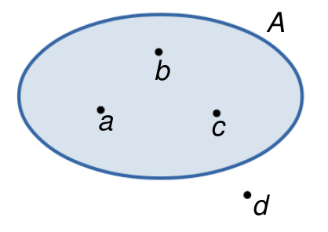
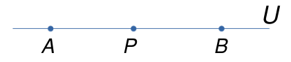
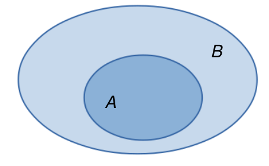
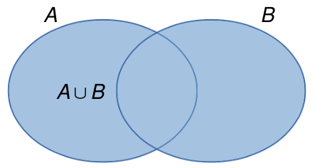
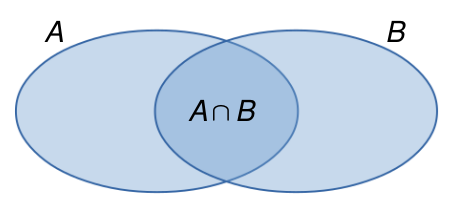
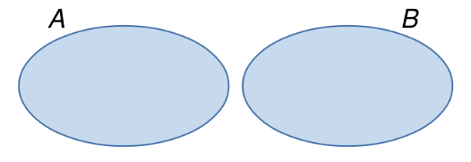
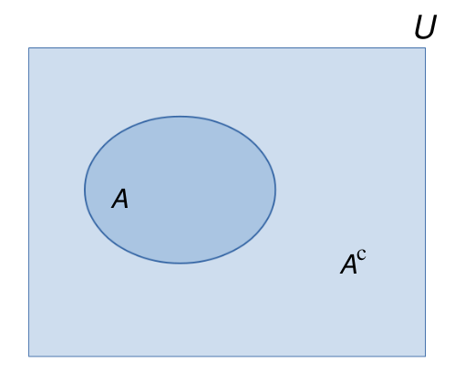
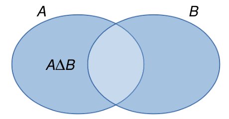

# Conjuntos 
<!--
You can label chapter and section titles using `{#label}` after them, e.g., we can reference Chapter \@ref(intro). If you do not manually label them, there will be automatic labels anyway, e.g., Chapter \@ref(methods).

Figures and tables with captions will be placed in `figure` and `table` environments, respectively.


```r
par(mar = c(4, 4, .1, .1))
plot(pressure, type = 'b', pch = 19)
```

<div class="figure" style="text-align: center">

<p class="caption">(\#fig:nice-fig)Here is a nice figure!</p>
</div>

Reference a figure by its code chunk label with the `fig:` prefix, e.g., see Figure \@ref(fig:nice-fig). Similarly, you can reference tables generated from `knitr::kable()`, e.g., see Table \@ref(tab:nice-tab).


```r
knitr::kable(
  head(iris, 20), caption = 'Here is a nice table!',
  booktabs = TRUE
)
```


Table: (\#tab:nice-tab)Here is a nice table!

 Sepal.Length   Sepal.Width   Petal.Length   Petal.Width  Species 
-------------  ------------  -------------  ------------  --------
          5.1           3.5            1.4           0.2  setosa  
          4.9           3.0            1.4           0.2  setosa  
          4.7           3.2            1.3           0.2  setosa  
          4.6           3.1            1.5           0.2  setosa  
          5.0           3.6            1.4           0.2  setosa  
          5.4           3.9            1.7           0.4  setosa  
          4.6           3.4            1.4           0.3  setosa  
          5.0           3.4            1.5           0.2  setosa  
          4.4           2.9            1.4           0.2  setosa  
          4.9           3.1            1.5           0.1  setosa  
          5.4           3.7            1.5           0.2  setosa  
          4.8           3.4            1.6           0.2  setosa  
          4.8           3.0            1.4           0.1  setosa  
          4.3           3.0            1.1           0.1  setosa  
          5.8           4.0            1.2           0.2  setosa  
          5.7           4.4            1.5           0.4  setosa  
          5.4           3.9            1.3           0.4  setosa  
          5.1           3.5            1.4           0.3  setosa  
          5.7           3.8            1.7           0.3  setosa  
          5.1           3.8            1.5           0.3  setosa  

You can write citations, too. For example, we are using the **bookdown** package [@R-bookdown] in this sample book, which was built on top of R Markdown and **knitr** [@xie2015].
-->

## Definição de conjunto

A notação matemática de conjunto é praticamente a mesma que se usa na linguagem comum.

Exemplos:

1. conjunto das vogais;
2. conjunto dos planetas do sistema solar;
3. conjunto dos  números ímpares positivos;
4. conjunto dos números primos positivos.

Cada membro que entra na formação do conjunto é chamado de *elemento*. Assim, nos exemplos anteriores, os elementos são:

1. a, e, i, o, u
2. Mercúrio, Venus, Terra, Marte,$\ldots$
3. $1, 3, 5, 7, 9,\ldots$
4. $2, 3, 5, 7, 11, 13,\ldots$

Um conjunto é indicado geralmente por uma letra maiúscula, $A, B, C,\ldots$ e os elementos são indicados por letras minúsculas $a, b, c, x, y, z,\ldots$

Na figura seguinte, temos que $a\in A$, $b\in A$, $c\in A$, enquanto que $d\not\in A$.

&nbsp;




## Descrição de um conjunto

Um conjunto pode ser descrito enumerando explicitamente os elementos do conjunto ou descrevendo uma propriedade característica de seus elementos.

Exemplos:

- Conjunto das vogais: $\{a, e, i, o, u\}$
- Conjunto dos números ímpares positivos: $\{1, 3, 5, 7, 9,\ldots\}$
- Conjunto dos inteiros positivos entre $1$ e $100$: $\{1, 2, 3,\ldots,100\}$
- $\{x\ |\ x \mbox{ é divisor inteiro de } 3\}$ = $\{1, -1, 3, -3\}$
- $\{x\ |\ x \mbox{ é inteiro e } 0\leq x\leq 50\}$ = $\{0, 1, 2,\ldots,50\}$

## Conjunto vazio

Chama-se *conjunto vazio* aquele conjunto que não possui elementos. Ele é denotado por $\emptyset$.

Exemplos:

- $\{x\ |\ x\neq x\} = \emptyset$
- $\{x\ |\ x \mbox{ é impar e múltiplo de } 2\} = \emptyset$
- $\{x\ |\ x>0 \mbox{ e } x<0\} = \emptyset$

## Conjunto universo

Em todo problema matemático envolvendo conjuntos, admitimos a existência de um conjunto $U$ ao qual pertencem todos os elementos utilizados no problema. Tal conjunto é chamado de *conjunto universo*.

Exemplos:

- $\{x\in U\ |\ x \mbox{ é um estado da região sul do Brasil}\} = \{$Paraná, Santa Catarina, Rio Grande do Sul$\}$. Neste caso, $U$ é o conjunto de todos os estados do Brasil.
- $\{x\in U\ |\ x \mbox{ é vogal}\}= \{a, e, i, o, u\}$. Neste caso, $U$ é o conjunto das letras do alfabeto da língua portuguesa.
- $\{x\in U\ |\ x \mbox{ é divisor inteiro de } 3\} = \{1, -1, 3, -3\}$. Neste caso, podemos considerar $U=\mathbb{Z}$ (conjunto dos inteiros).

Muitas vezes, a resposta a nosso problema depende do conjunto universo que estamos considerando.

Exemplo: 

Qual é o conjunto dos pontos $P$ que ficam a igual distância de $A$ e $B$ ? 

Se consideramos o conjunto universal $U$ como sendo a reta que contém os pontos $A$ e $B$, então o conjunto $P$ dos pontos equidistantes de $A$ e $B$ está formado por um único ponto, como mostra a seguinte figura:

&nbsp;



&nbsp;

Por outra parte, se consideramos $U$ como sendo o plano contendo os pontos $A$ e $B$, então o conjunto $P$ é a reta mediatriz do segmento $AB$, como mostra a figura embaixo: 

&nbsp;


&nbsp;

## Conjuntos iguais

Dois conjuntos $A$ e $B$ são iguais se todo elemento de $A$ pertence a $B$ e todo elemento de $B$ pertence a $A$.

$$A=B\ \ \Longleftrightarrow\ \ \forall x, (x\in A \Leftrightarrow x\in B)$$

Se o conjunto $A$ é diferente do conjunto $B$, escrevemos $A\neq B$.

Exemplos:

- $\{a, b, c, d\} = \{b, a, d, c\}$
- $\{x\ |\ 3x+2 = 8\} = \{2\}$
- $\{a, b, c\}\neq\{a, b, c, d\}$

## Subconjuntos

Um conjunto $A$ é um *subconjunto* do conjunto $B$ se todo elemento de $A$ é também um elemento de $B$.

$$A\subset B\ (\mbox{ou } B\supset A)\ \ \Longleftrightarrow\ \ \forall x, (x\in A \Rightarrow x \in B)$$

&nbsp;



&nbsp;

Leia-se: $A\subset B$ ($A$ está contido em $B$) e $B\supset A$ ($B$ contém $A$). Se $A$ não está contido em $B$ (ou $B$ não contém $A$) escrevemos $A\nsubseteq B$ (ou $B\nsupseteq A$).

Podemos definir a igualdade entre conjuntos através da inclusão. De fato, temos que 

$$A = B \ \ \Longleftrightarrow\ \ (A\subset B \mbox{ e } B\subset A)$$

Exemplos:

- $\{a, b, c\}\subset \{a, b, c, d\}$
- $\{x\ |\ x \mbox{ é inteiro e par}\}\subset \{x\ |\ x \mbox{ é inteiro}\}$
- $\{a, b\}\nsubseteq \{a, c, d, e\}$
- $\{x\ |\ x \mbox{ é inteiro e par}\}\nsubseteq \{x\ |\ x \mbox{ é inteiro e primo}\}$

Sejam $A, B$ e $C$ conjuntos. Algumas propriedades da inclusão são as seguintes:

1. Para todo conjunto $A$, temos que $\emptyset\subset A$
2. $A\subset A$ (reflexiva)
3. $(A\subset B \mbox{ e } B\subset A)\ \Longrightarrow\ A=B$ (anti-simétrica)
4. $(A\subset B \mbox{ e } B\subset C)\ \Longrightarrow\ A\subset C$ (transitiva)

## Conjunto das partes

Dado um conjunto $A$, o *conjunto das partes de* $A$ é o conjunto formado por todos os subconjuntos de $A$:

$$\mathcal{P}(A) = \{B\ |\ B\subset A\}$$

Observar que $\mathcal{P}(A)$ é um conjunto cujos elementos também são conjuntos.

Por exemplo, se $A = \{a, b, c\}$, então $\mathcal{P}(A) = \{\emptyset, \{a\}, \{b\}, \{c\}, \{a, b\}, \{a, c\}, \{b, c\}, A\}$.

Pode-se provar que se $A$ contém $n$ elementos, então $\mathcal{P}(A)$ contém $2^n$ elementos.

## União e interseção de conjuntos

Dados dois conjuntos $A$ e $B$, a *união* de $A$ com $B$ é o conjunto formado pelos elementos que pertencem a $A$ ou a $B$:

$$A\cup B = \{x\ |\ x\in A \mbox{ ou } x\in B\}$$

&nbsp;



&nbsp;


Exemplos:

- $\{a, b\}\cup \{c, d\} = \{a, b, c, d\}$
- $\{a, b, c\}\cup \{c, e, f\} = \{a, b, c, e, f\}$
- $\{a, b\}\cup \emptyset = \{a, b\}$
- $\emptyset \cup \emptyset = \emptyset$

Sejam $A, B$ e $C$ conjuntos. Algumas propriedades da união são as seguintes:

1. $A\cup A = A$ (idempotente)
2. $A \cup \emptyset = A$ (elemento neutro)
3. $A\cup B = B\cup A$ (comutativa)
4. $(A\cup B)\cup C = A\cup (B\cup C)$ (associativa)
5. $A\subset (A\cup B)$

&nbsp;

Dados dois conjuntos $A$ e $B$, a *interseção* de $A$ com $B$ é o conjunto formado pelos elementos que pertencem a $A$ e a $B$:

$$A\cap B = \{x\ |\ x\in A \mbox{ e } x\in B\}$$

&nbsp;



&nbsp;


Dois conjuntos $A$ e $B$ são *disjuntos* se eles não tem elementos em comum, ou seja, $A\cap B = \emptyset$.

&nbsp;



&nbsp;


Exemplos:

- $\{a, b, c\}\cap\{a, b, d, e\} = \{a, b\}$
- $\{a, b\}\cap\{a, b, c\} = \{a, b\}$
- $A\cap\emptyset = \emptyset$
- $\{a, b\}\cap\{c, d\} = \emptyset$

Sejam $A, B$ e $C$ conjuntos. Algumas propriedades da interseção são as seguintes:

1. $A\cap A = A$ (idempotente)
2. Se $A\subset B$, então $A\cap B = A$. Em particular, para todo conjunto $A$, temos que $A\cap U = A$ (elemento neutro)
3. $A\cap B = B\cap A$ (comutativa)
4. $A\cap (B\cap C) = (A\cap B)\cap C$ (associativa)
5. $(A\cap B)\subset A$

Outras propriedades envolvendo uniões e interseções são as seguintes:

1. $A\cup (B\cap C) = (A\cup B) \cap (A\cup C)$ (distributiva da união em relação à interseção)
2. $A\cap (B\cup C) = (A\cap B) \cup (A\cap C)$ (distributiva da interseção em relação à união)
3. $A\cup (A\cap B) = A$
4. $A\cap (A\cup B) = A$


## Complementar de um conjunto

Dado um conjunto $A$, o *complementar* de $A$ (em relação a $U$) é o conjunto formado pelos elementos do conjunto universo $U$ que não estão em $A$:

$$A^{\mathrm{c}} = \{x\in U\ |\ x\not\in A\}$$
Observe que a definição de complementar depende do conjunto universo considerado.

&nbsp;



&nbsp;

Exemplos:

- Se $U = \{a, b, c, d, e, f\}$, então $\{a, b, c\}^{\mathrm{c}} = \{d, e, f\}$
- Se $U = \{1, 2, 3, 4,\ldots\}$ (conjunto dos números naturais), então $\{1,3\}^{\mathrm{c}} = \{2, 4, 5, 6,\ldots\}$ 

Em particular, temos que

- $U^\mathrm{c} = \emptyset$
- $\emptyset^\mathrm{c} = U$

## Diferença de conjuntos

Dados dois conjuntos $A$ e $B$, a *diferênça* entre $A$ e $B$ é o conjunto formado pelos elementos de $A$ que não estão em $B$:

$$A-B = \{x\ |\ x\in A \mbox{ e } x\not\in B\}$$

Pode-se provar que $A-B = A\cap B^\mathrm{c}$.

&nbsp;


&nbsp;


A *diferença simétrica* entre $A$ e $B$ é definida como o conjunto formado pelos elementos que estão em $A\cup B$ e que não estão em $A\cap B$:

$$A\Delta B = (A\cup B) - (A\cap B) = (A\cup B)\cap (A\cap B)^\mathrm{c}$$

&nbsp;



&nbsp;

Operações de conjuntos envolvendo uniões, interseções, complementares e diferênças são chamadas de *operações boleanas de conjuntos*.

## Exercícios
