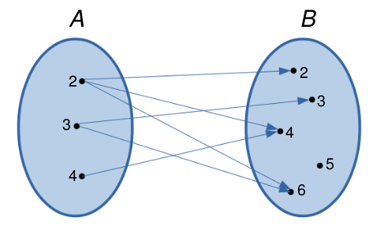
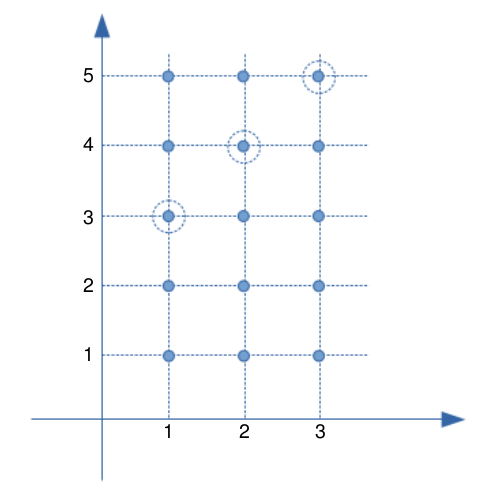
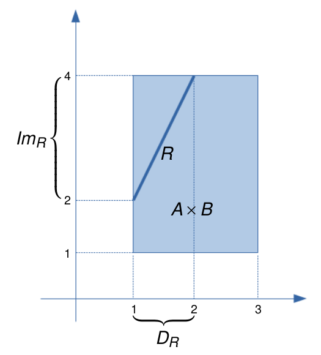
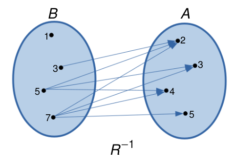
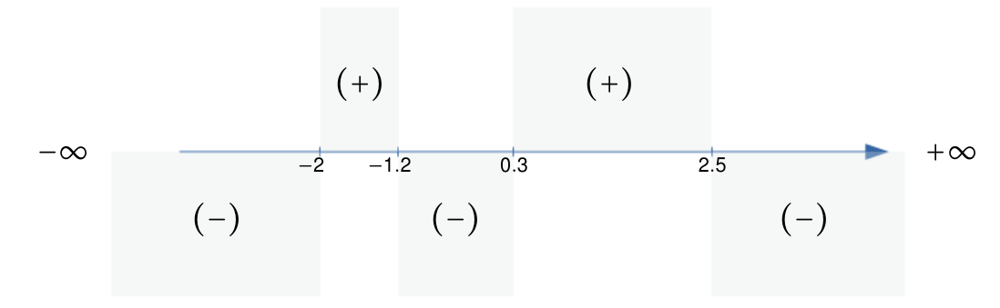
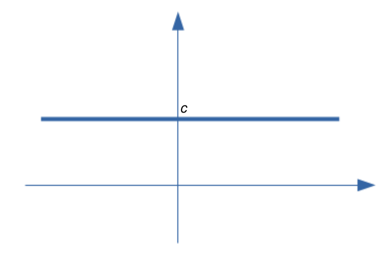
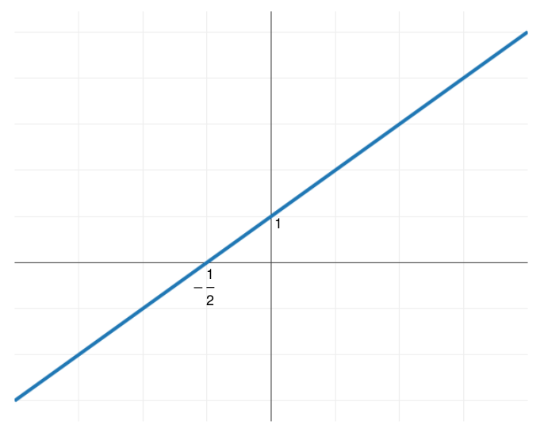
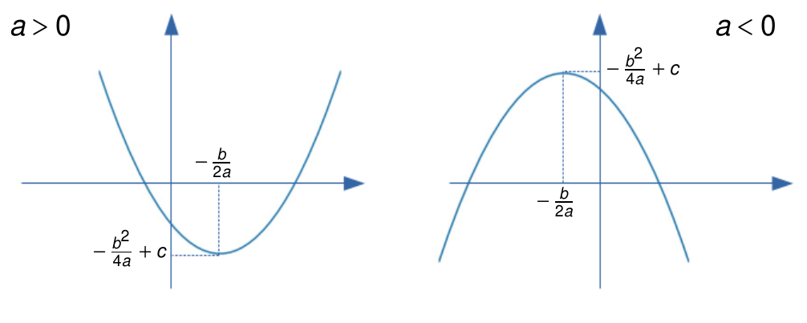

# Funções

## Par ordenado

Dados dois elementos quaisquer $a$ e $b$ de um conjunto, o conjunto $\{a,b\}$ formado por $a$ e $b$ é chamado de par.
Observar que $\{a,b\}=\{b,a\}$ (a ordem não interessa). No entanto, existem situações em que a ordem é importante.

Dados dois elementos $a$ e $b$ de um conjunto, definimos o *par ordenado* formados pelos elementos $a$ e $b$ como sendo o elemento $(a,b)$. Todo par ordenado satisfaz a seguinte condição:

$$(a,b) = (c,d)\ \Longleftrightarrow\ a=c\ \mbox{ e }\ b=d$$

Neste caso, a ordem dos elementos é importante, ou seja, temos que em geral, $(a,b)\neq (b,a)$.

Uma forma geométrica de visualizar um par ordenado $(a,b)$ é representá-lo como um ponto no plano cartesiano. Na figura seguinte são representados graficamente os pares ordenados $A=(0,1)$, $B=(-1,3)$ e $C=(2,2)$.

&nbsp;

&nbsp;

Existe uma correspondência biunívoca entre pares ordenados e pontos do plano cartesiano.

## Produto cartesiano

Sejam $A$ e $B$ conjuntos não vazios. O *produto cartesiano* de $A$ com $B$ é o conjunto formado por todos os pares ordenados $(a,b)$ em que $a\in A$ e $b\in B$:

$$A\times B = \{(a,b)\ :\ a\in A,\ b\in B\}$$

Da definição de produto cartesiano, vemos que se $A$ tem $n$ elementos e $B$ tem $m$ elementos, então $A\times B$ tem $nm$ elementos.

Se $A=\emptyset$ ou $B=\emptyset$, definimos $A\times B = \emptyset$.

Exemplo:

- Se $A=\{2,3,4\}$ e $B=\{1,2\}$, então $A\times B = \{(2,1), (2,2), (3,1), (3,2), (4,1), (4,2)\}$ $B\times A = \{(1,2), (1,3), (1,4), (2,2), (2,3), (2,4)\}$ e $B\times B=B^2=\{(1,1), (1,2), (2,1), (2,2)\}$.

&nbsp;

&nbsp;

Um caso importante é o produto cartesiano $\mathbb{R}\times\mathbb{R} = \mathbb{R}^2 = \{(x,y)\ :\ x,y\in\mathbb{R}\}$ (plano cartesiano).

No caso em que $A = [a,b]$ e $B = [c,d]$ são intervalos da reta, então $A\times B = \{(x,y)\ :\ x\in[a,b] \ \mbox{ e }\ y\in[c,d]\}$.

&nbsp;

&nbsp;

## Relação binária

Considere os conjuntos $A = \{2,3,4\}$ e $B = \{2,3,4,5,6\}$. O produto cartesiano de $A$ com $B$ é dado por $A\times B = \{(x,y)\ :\ x\in A,\ y\in B\}$ e contém $3\times 5 = 15$ elementos.

Consideremos agora os pares ordenados de $(x,y)\in A\times B$ tais que $x$ é divisor de $y$,

$$R = \{(x,y)\in A\times B\ :\ x \mbox{ é divisor de } y\} = \{(2,2), (2,4), (2,6), (3,3), (3,6), (4,4)\}$$

O conjunto $R$ é um exemplo de *relação binária* de $A$ em $B$. 

&nbsp;

&nbsp;

Dessa forma, dados dois conjuntos $A$ e $B$, uma *relação binária* de $A$ em $B$ é um conjunto $R$ tal que $R\subset A\times B$. Em particular, para qualquer conjunto $A$, uma relação binária em $A$ é um subconjunto $R\subset A\times A$.

O conjunto $A$ é chamado *conjunto de partida* da relação binária e o conjunto $B$ é chamado *conjunto de chegada*.

Se o par ordenado $(x,y)$ pertence à relação binária $R$, escrevemos $xRy$ ($x$ está relacionado com $y$), ou seja,

$$(x,y)\in R\ \Longleftrightarrow\ xRy$$

Exemplos:

1. Sejam os conjuntos $A= \{1,2,3\}$ e $B= \{1,2,3,4,5\}$. Consideremos a relação $R=\{(x,y)\in A\times B\ :\ y=x+2\}$.

&nbsp;

&nbsp;

2. Sejam os conjuntos $A = B = [0,1]$. Consideremos a relação $R = \{(x,y)\in A\times B\ :\ x = y\}$.

&nbsp;

&nbsp;

## Domínio e Imagem de uma relação

Dada uma relação binária  $R$ de $A$ em $B$, o *domínio* de $R$ é o conjunto de todos os primeiros elementos dos pares ordenados em $R$, ou seja,

$$D_{R} = \{x\in A\ :\ (x,y)\in R\}\subset A$$

Cháma-se *imagem* de $R$ ao conjunto de todos os segundos elementos dos pares ordenados em $R$, ou seja,

$$Im_{R} = \{y\in B\ :\ (x,y)\in R\}\subset B$$
Nos exemplos anteriores, temos que:

1. $D_{R} =\{1,2,3\}=A$, $Im_{R}=\{3,4,5\}$.
2. $D_R= A$, $Im_{R}=B$.

Se $A = \{x\in\mathbb{R}\ :\ 1\leq x\leq 3\}$, $B = \{y\in\mathbb{R}\ :\ 1\leq y\leq 4\}$ e $R = \{(x,y)\in A\times B\ :\ y = 2x\}$, então, temos que $D_{R} = \{x\in A\ :\ 1\leq x\leq 2\}$ e $Im_{R} = \{y\in B\ :\ 2\leq y\leq 4\}$.

&nbsp;

&nbsp;

## Relação inversa

Dada uma relação binária $R$ de $A$ em $B$, a relação inversa $R^{-1}$ de $B$ em $A$ é definida por

$$R^{-1} = \{(y,x)\in B\times A\ :\ (x,y)\in R\}$$

Exemplos:

- Sejam os conjuntos $A = \{2,3,4,5\}$ e $B = \{1,3,5,7\}$. Se $R = \{(x,y)\in A\times B\ :\ x<y\} = \{(2,3), (2,5), (2,7), (3,5), (3,7), (4,5), (4,7), (5,7)\}$, então $R^{-1} = \{(x,y)\ :\ x>y\} = \{(3,2), (5,2), (7,2), (5,3), (7,3), (5,4), (7,4), (7,5)\}$.

&nbsp;

&nbsp;

- Sejam os conjuntos $A = \{x\in\mathbb{R}\ :\ 1\leq x\leq 2\}$ e $B = \{y\in\mathbb{R}\ :\ 1\leq y\leq 4\}$. Se $R = \{(x,y)\in A\times B\ :\ y = 2x\}$, então $R^{-1} = \{(x,y)\in B\times A\ :\ y = \displaystyle\frac{x}{2}\}$.

&nbsp;

&nbsp;

Propriedades:

1. $D_{R^{-1}} = Im_{R}$ (o domínio de $R^{-1}$ é igual à imagem de $R$)
2. $Im_{R^{-1}} = D_{R}$ (a imagem de $R^{-1}$ é igual ao domínio de $R$)
3. $(R^{-1})^{-1} = R$ (a relação inversa de $R^{-1}$ é igual a $R$)

## O conceito de função

Sejam $A$ e $B$ conjuntos não vazios. Uma *aplicação* ou *função* $f$ de $A$ em $B$ é uma relação binária tal que para todo $x\in A$, existe um único ponto $y\in B$ tal que $(x,y)\in R$. Em notação matemática:

$$R \mbox{ é função }\ \Longleftrightarrow\ \forall x\in A,\ \exists\,!\ y\in B \mbox{ tal que } (x,y)\in R$$

&nbsp;

&nbsp;

&nbsp;

&nbsp;

Observar que a primeira relação não é função, uma vez que, por exemplo, o elemento $2\in A$ é mapeado em três elementos em $B$ ($2,4$ e $6$). A segunda e terceira relação são funções, pois satisfazem a definição. Finalmente, a quarta relação não é função, pois o elemento $3\in A$ não é mapeado em nenhum elemento de $B$. 

Usaremos a notação $f: A \longrightarrow B$ para denotar uma função $f$ de $A$ em $B$. O conjunto $A$ recebe o nome de *domínio da função* (denotado por $D_f$) e o conjunto $B$ é chamado de *contradomínio da função*. 

Se a função $f$ mapea o elemento $x\in A$ no elemento $y\in B$, denotamos isso por $y=f(x)$. Assim, por exemplo, na terceira relação acima, temos que $3=f(2)$, $2=f(3)$ e  $4=f(4)=f(5)$.

Outro conjunto importante é a *imagem da função* (denotada por $Im_f$), definida por

$$Im_f = \{y\in B\ :\ y=f(x), \mbox{ para algum } x\in A\}$$

Por exemplo, na terceira relação (a qual é função), temos que o conjunto imagem é $Im_f=\{2,3,4\}$. Observar que, neste caso, $1\not\in Im_f$, pois não existe um elemento $x$ em $A$ tal que $1 = f(x)$. 

## Gráfico de funções

Consideremos uma função $f:A\longrightarrow B$. Em geral, consideraremos funções em que $A$ e $B$ são subconjuntos da reta. Nesse caso, o *gráfico* de $f$ é o subconjunto de $\mathbb{R}^2$ definido por 

$$\mathrm{Graf}(f) = \{(x,f(x))\in\mathbb{R}^2\ :\ x\in A\}$$

Exemplos de funções:

- $f:\mathbb{R}\longrightarrow \mathbb{R}$, definida por $f(x) = x$. Neste caso, $D_f=\mathbb{R}$ e $Im_f=\mathbb{R}$.

&nbsp;

&nbsp;

- $f:\mathbb{R}\longrightarrow \mathbb{R}$, definida por $f(x) = x^2$. Neste caso, $D_f=\mathbb{R}$ e $Im_f = \mathbb{R}_{\geq 0}$.

&nbsp;

&nbsp;

- $f: [-1,2]\longrightarrow \mathbb{R}$, definida por $f(x) = x^3$. Neste caso, $D_f=[-1,2]$ e $Im_f=[-1,8]$.

&nbsp;

&nbsp;

Os seguintes são exemplos de relações que não são funções, pois é possível traçar uma reta vertical que corta ao gráfico em dois pontos.

&nbsp;

&nbsp;

## Funções iguais 

Duas funções $f:A\longrightarrow B$ e $g:C\longrightarrow D$ são *iguais* se:

- Os domínios são iguais: $A=C$;
- Para todo $x$, $f(x)=g(x)$.

Se as funções $f$ e $g$ são iguais, escrevemos $f=g$. Nesse caso, se verifica facilmente que $Im_f = Im_g$.

## Características importantes das funções

### Zeros (ou raíçes) de uma função

Os zeros de uma função é definido como o conjunto de pontos $x\in D_f$ que satisfazem $f(x)=0$. Nos exemplos anteriores, vemos que $x=0$ é zero das funções $f_1(x)=x$, $f_2(x)=x^2$ e $f_3(x)=x^3$, pois se verifica que $f(0)=0$. 

### Sinal de uma função

Quando graficamos funções, uma característica importante a ser examinada é o sinal da função, isto é, ver quais são os valores de $x\in\mathbb{R}$ tais que $f(x)>0$, $f(x)=0$ ou $f(x)<0$.

Por exemplo, seja a função $y=f(x)$ cujo gráfico é dado por

&nbsp;

&nbsp;

Os zeros da função são $x_1=-2$, $x_2=-1.2$, $x_3=0.3$ e $x_4=2.5$, ou seja, nestes pontos, temos que $f(x)=0$. Do gráfico, podemos observar o seguinte comportamento:

- Para $x< -2$, temos que $f(x)<0$.
- Para $-2<x<-1.2$, temos que $f(x)>0$.
- Para $-1.2<x<0.3$, temos que $f(x)<0$.
- Para $0.3<x<2.5$, temos que $f(x)>0$.
- Para $x>2.5$, temos que $f(x)<0$.

Dessa forma, identificamos $5$ intervalos onde a função não muda de sinal.

&nbsp;

&nbsp;

## Tipos de funções

### Função constante

Uma função $f$ tal que $f(x)=c$ para todo $x\in D_f$, em que $c$ é uma constante, é chamada de *função constante*. Nesse caso, sempre temos que $Im_f=\{c\}$.

Exemplos:

- $f:\mathbb{R}\longrightarrow \mathbb{R}$ definida por $f(x)=2$, para todo $x$. Nesse caso, $D_f=\mathbb{R}$ e $Im_f=\{2\}$.

- $f:\mathbb{R}\longrightarrow \mathbb{R}$ definida por $f(x)=-3$, para todo $x$. Nesse caso, $D_f=\mathbb{R}$ e $Im_f=\{-3\}$.

- $f:\mathbb{R}\longrightarrow \mathbb{R}$ definida por $f(x)=0$, para todo $x$. Nesse caso, $D_f=\mathbb{R}$ e $Im_f=\{0\}$.

&nbsp;

&nbsp;

### Função linear

Uma função $f:\mathbb{R}\longrightarrow\mathbb{R}$ definida por $f(x)=ax$, para todo $x$, em que $a\neq 0$ é uma constante, é chamada *função linear*. Observar que $D_f=\mathbb{R}$ e $Im_f=\mathbb{R}$.
Em particular, quando $a=1$, a função $f(x)=x$, para todo $x$, é chamada *função identidade*. O gráfico da função identidade é mostrado a seguir:

&nbsp;

&nbsp;

### Função afim

Uma função $f:\mathbb{R}\longrightarrow \mathbb{R}$ definida por $f(x)=ax+b$, para todo $x$, em que $a\neq 0$ e $b$ são constantes, é chamada função *afim* ou de $1º$ grau. Se $f$ é função afim, então $D_f=\mathbb{R}$ e $Im_f=\mathbb{R}$.

&nbsp;

&nbsp;

O gráfico da função afim $f(x)=ax+b$ é uma reta que corta o eixo de ordenada em $y=b$ (ordenada ao origem) e o eixo de absiça em $x=-\displaystyle\frac{b}{a}$ (zero da função). Observar que quando $b=0$, obtemos a função linear definida anteriormente.

O coeficiente $a$ da função afim é chamado de *coeficente angular* ou *declividade* da reta. O coeficiente $b$ é chamado de *coeficiente linear*. Assim, se $a>0$, dizemos que o gráfico da função afim tem *declividade positiva*, caso contrário ($a<0$) dizemos que tem *declividade negativa*.

A obtenção dos zeros da função afim permitem fazer o seguinte análise do sinal da função:

- Se $a>0$, então $f(x)<0$ se $x<-\displaystyle\frac{b}{a}$ e $f(x)>0$ se $x>-\displaystyle\frac{b}{a}$.
 

- Se $a<0$, então $f(x)>0$ se $x<-\displaystyle\frac{b}{a}$ e $f(x)<0$ se $x>-\displaystyle\frac{b}{a}$.

Exemplo: Obtenha a equação da reta que passa pelo ponto $(1,3)$ e tem coeficiente angular igual a $2$.

Temos que a equação geral da reta é $f(x) = ax + b$. Dado que o coeficiente angular é $2$, então $a=2$. Além disso, a reta passa pelo ponto $(1,3)$. Logo, fazendo $x=1$, temos que $f(1)=2\cdot1 + b=3$, o qual implica que $b=1$. Assim, concluimos que a reta tem equação $f(x)=2x+1$. Observar que a reta corta o eixo $x$ no ponto $x_1=-\displaystyle\frac{b}{a}=-\frac{1}{2}$. A ordenada ao origem é $b=1$.

&nbsp;

&nbsp;

### Função quadrática

Uma função $f:\mathbb{R}\longrightarrow \mathbb{R}$ na forma $f(x)=ax^2+bx+c$, em que $a\neq0$, $b$ e $c$ são constantes, é chamada *função quadrática* ou de $2º$ grau.

Exemplos de funções quadráticas:

- $f(x)=2x^2-3x+1$, em que $a=2$, $b=-3$ e $c=1$;
- $f(x)=-5x^2-3$, em que $a=-5$, $b=0$ e $c=-3$;
- $f(x)=\displaystyle\frac{2}{5}x^2+\frac{3}{2}x$, em que $a=\displaystyle\frac{2}{5}$, $b=\displaystyle\frac{3}{2}$ e $c=0$. 

O gráfico de uma função quadrática é uma parábola cuja concavidade é voltada para cima se $a>0$ e voltada para embaixo se $a<0$.

&nbsp;

&nbsp;

O gráfico da função quadrática atinge seu valor mínimo (quando $a>0$) ou seu valor máximo (quando $a<0$) no ponto $x=-\displaystyle\frac{b}{2a}$ (este fato pode ser provado usando o conceito de derivada). Nesses pontos, a função atinge o valor

$$f\!\left(-\displaystyle\frac{b}{2a}\right) = a\left\{-\displaystyle\frac{b}{2a}\right\}^2 + b\left\{-\displaystyle\frac{b}{2a}\right\} + c = -\frac{b^2}{4a}+c$$
O par ordenado $V=(-\displaystyle\frac{b}{2a}\ ,\ -\frac{b^2}{4a}+c)$ é chamado *vértice da parábola*.

Observar que $D_f=\mathbb{R}$. Além disso:

- Se $a>0$, então $Im_f=\{y\in\mathbb{R}\ :\ y\geq -\displaystyle\frac{b^2}{4a}+c\}$.
 

- Se $a<0$, então $Im_f=\{y\in\mathbb{R}\ :\ y\leq -\displaystyle\frac{b^2}{4a}+c\}$.

Para achar os zeros de uma função quadrática, observemos que 

$$ax^2+bx+c=0\ \Longrightarrow\ x=\displaystyle\frac{-b \pm \sqrt{b^2-4ac}}{2a}$$

A quantidade $\Delta=b^2-4ac$ dentro da raiz é chamado *discriminante*. O valor de $\Delta$ permite "discriminar" entre os seguintes casos:

- Se $\Delta>0$, então a função quadrática tem exatamente duas raíces reais.
- Se $\Delta=0$, então a função quadrática tem exatamente uma raiz real.
- Se $\Delta<0$, então a função quadrática não tem raíces reais.

As três situações são ilustradas no seguinte gráfico.

&nbsp;

&nbsp;

Para fazer uma análise do sinal da função quadrática $f(x)=ax^2 +bx +c$, devemos considerar o sinal do discriminante $\Delta$ e da constante $a$. Assim, temos seis casos possíveis:

- Se $\Delta>0$, então temos duas raíçes reais e distintas, digamos $x_1$ e $x_2$, sendo $x_1<x_2$ e $f(x_1)=f(x_2)=0$. Nesse caso, temos duas situações: se $a>0$, temos que $f(x)>0$ para $x<x_1$ ou $x>x_2$ e $f(x)<0$ para $x_1<x<x_2$. Se $a<0$, então $f(x)<0$ para $x<x_1$ ou $x>x_2$ e $f(x)>0$ para $x_1<x<x_2$.
- Se $\Delta=0$, então temos uma única raíz real $x_1$, sendo $f(x_1)=0$. Assim temos que se $a>0$, então $f(x)>0$ para todo $x\neq x_1$. Se $a<0$, então $f(x)<0$ para todo $x\neq x_1$.
- $\Delta<0$, então não existem raíçes reais. Portanto, se $a>0$, então $f(x)>0$ para todo $x$. Se $a<0$, então $f(x)<0$ para todo $x$.

Como exemplo, considere a função quadrática $f(x)=x^2-2x+1$. Neste caso, $a=c=1$ e $b=-2$. Observar que $\Delta=(-2)^2 - 4\cdot1\cdot1=0$. Logo, a função tem uma única raíz real $x_1=\displaystyle\frac{-b\pm\sqrt{\Delta}}{2a}=1$. Dado que $a=1>0$, vemos que a $f(x)>0$ para $x\neq 1$ e $f(1)=0$. A ordenada ao origem é $-\displaystyle\frac{b}{2a}=1$.

&nbsp;

&nbsp;
